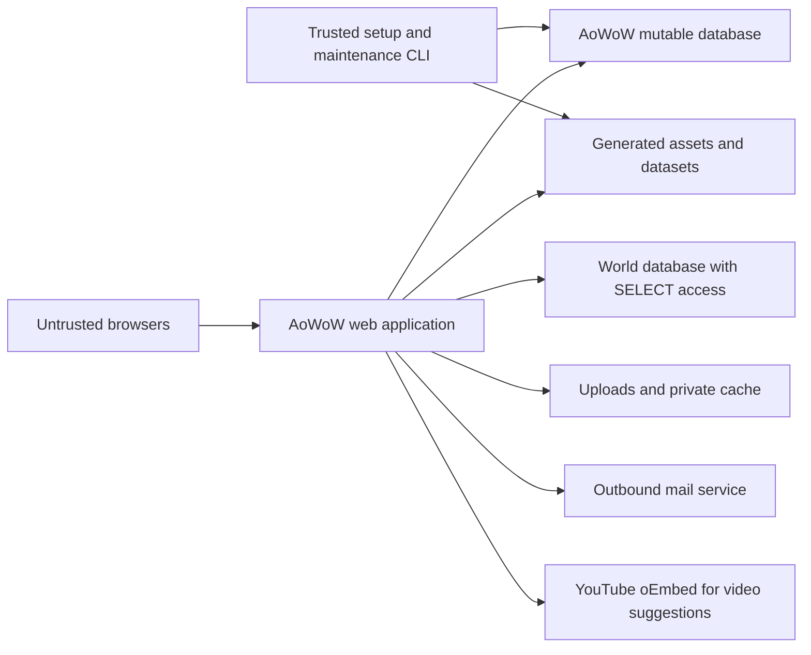

# AoWoW security review

This is the consolidated audit and remediation record, updated **October 8,
2026**. The latest remediation is application revision **71**, implemented
locally in the working tree based on commit **40dfc01bea2d65c9c27bb25823e0121572a7e612**.
Reviewed snapshots and completed commits are recorded in the dated history.
It combines the October 2–3 audit and October 8 follow-up,
retaining original evidence, finding IDs, implementation history and validation
boundaries. Historical line citations refer to the stated reviewed revisions;
current source paths remain linked, but line numbers can move.

## Current status and pending work

| Finding | Current source status | Remaining action |
| --- | --- | --- |
| [R01 — CAPTCHA verification work](#r01--captcha-verification-has-no-attempt-budget-before-outbound-work) | Implemented locally in revision 71; regression evidence below | Deploy Turnstile and its new budget component together; verify limits, retries and trusted peer attribution under the actual FPM/proxy. No new migration or JavaScript build is required on an updated installation. |
| [R03 — General-feedback quotas](#r03--general-feedback-has-no-submission-or-storage-budget) | **Open — P2 / Medium** | Independently bound anonymous feedback requests and retained storage. Verification limits apply only when CAPTCHA is enabled; retained-feedback storage remains unbudgeted. |
| A01–A16 | Source fixes or hardening implemented; local regression checks recorded | Complete the deployment, historical-data and integration checks below. These are not sixteen unfinished source fixes. |
| [R02 — Content reports](#r02--anonymous-content-reports-without-quotas) | Implemented in revision 70; 200 focused checks pass | Deploy the PHP changes and rebuild `globaljs`; verify behavior under the actual web identity and trusted client-IP configuration. |

R03 is the remaining source fix established by this consolidated record.
R01 is locally implemented and tested; deployment acceptance remains separate.
No new high/critical source finding was established in the October 8
follow-up. This is a source review plus local fixture evidence, not a production
readiness sign-off or an exhaustive new audit of every endpoint.

The following acceptance work remains **unverified by these audits**. This does
not imply it was never done by the operator; no evidence of completion is recorded
here. The detailed [launch gates](#4-deployment-acceptance-and-launch-gates) still
apply.

| Acceptance area | Evidence still needed |
| --- | --- |
| Schema and generated assets | Successful `php aowow --update`, compatible schema/budget/journal tables, generated assets deployed together with PHP, and actual generator completion. R02 adds no new migration; rebuild `globaljs` as the website OS user. |
| Host and proxy boundaries | Effective HTTP private-path/script denial on all application/static origins, trusted client-IP attribution, private operator policy, site-specific FPM identity, immutable PHP/configuration, private cache key, correct writable-path permissions and minimum database grants. |
| Historical secrets and content | Assess old logs/backups, expire or reissue exposed/pre-fix tokens as applicable, review historical uploads, and account for stored data that predates contribution reservations. Existing content is not automatically discarded by the fixes. |
| Account, mail and contribution flows | Pending/active/banned/staff lifecycle checks, recovery/session revocation, activation/resend delivery, uploads/cropping/moderation, and R02 denial/limit behavior through the deployed site. Keep public production `DEBUG=0`; high debug levels still display mail/token content and suppress actual sending. |
| Operations and capacity | Backup/restore and interrupted-upgrade recovery rehearsal; scheduled `--prune` preview/apply under the web OS user; disk/database/FPM/SMTP monitoring and traffic limits; hashing, SMTP/outbound deadlines and enabled expensive-listing load acceptance. |
| Optional integrations/platforms | Auth/characters/profiler integrations when enabled, real relay/DNS/Cloudflare behavior, and the actual database/PHP-FPM/proxy versions. MySQL fixtures do not establish MariaDB, Windows or external-provider acceptance. |

## Review history

Reviewed **October 2, 2026** against AoWoW source, Git commit
**ea2e7d97f4594208f0f8006b32d68ef9a0e8fa25**,
application revision **52**. Original finding evidence refers to this snapshot,
not to every upstream release. A01's implementation status records revision
**53** remediation; A02 records revision **54**, A03 revision **55**, and A04
revision **56**, A06 revision **57**, A07 revision **58**, A05 revision **59**,
A08 revision **60**, A09 revision **61**, A10 revision **62**, A11 revision **63**,
A12 revision **64**, A13 revision **65**, A14 revision **66**, A15 revision **67**,
and A16 revision **68**.
Source paths and line numbers are relative to this
repository's root; source links resolve from `docs/`.

**Historical assessment:** the original revision 52 was unsuitable for public
registration/contributions. A01–A16 received tested source fixes or hardening
through revision 68. The current status table above includes the later review
and remediation; deployment and full-site staging acceptance remain separate.
Keep historical tokens/logs/files and deployment prerequisites in scope as
specified by the launch gates.

This is a source and deployment-design review. No production system, user
database, game client, or live account was accessed. The original review made
no application patches; subsequent remediations are recorded below. A confirmed
source defect means the unsafe behavior is established
by its code path; it does not mean a browser exploit or production compromise
was demonstrated.

## 1. Application scope and trust boundaries

AoWoW provides a WoW 3.3.5a database website with local accounts, email activation,
comments, screenshots, guides, and moderation. This review focuses on local
authentication and community contributions. Optional realm authentication and
profiling integrations were inspected for boundaries but not fully tested.
The source requires PHP ≥ 8.4, as declared in [composer.json](../composer.json).

### Entry points and authority

| Boundary | Source evidence | Consequence |
| --- | --- | --- |
| Public application | [index.php](../index.php):11–101 selects a responder from the first query parameter; additional parameters select JSON, RSS, tooltip, XML, and admin actions | Preserve query-string routing. Direct PHP endpoint URLs are not the supported public interface. |
| Bootstrap | [includes/kernel.php](../includes/kernel.php):136–194 loads executable PHP configuration, connects databases, loads DB settings, and starts sessions | Both AoWoW and world connections are mandatory for normal web requests. |
| Request filters and roles | [BaseResponse](../includes/components/response/baseresponse.class.php):459–544 and [User](../includes/user.class.php):412–489 | Login and group checks are server-side, but are not a CSRF defense. |
| Build/maintenance CLI | [aowow](../aowow), [setup/setup.php](../setup/setup.php), and [CLISetup](../setup/tools/CLISetup.class.php) | CLI runs from the application root, imports/generates data, writes files, and can create administrators. Deny it through HTTP. |
| Web administration | [endpoints/admin](../endpoints/admin) | Staff can moderate contributions; administrators/developers can change DB-backed settings and PHP INI settings, inspect PHP information, and trigger file generation. |
| Background profiling | [Profiler::queueStart/queueStatus](../includes/components/profiler.class.php):88–128 and [prQueue](../prQueue) | Executes PHP and process-inspection commands. If profiling is unused, disable it and omit auth/characters credentials. |
| SQL translation | [includes/database.php](../includes/database.php):119–139 | Uses Dibi translation and native execution. Its modifiers are not evidence that every query is safe, nor are these uniformly native prepared statements. |

### Files, services, and data ownership

| Resource | Production policy |
| --- | --- |
| `index.php`, `includes/`, `endpoints/`, `localization/`, `template/`, `setup/` | Deploy trusted runtime/build PHP scripts but keep them outside the HTTP allowlist and immutable to PHP-FPM. `index.php` is the only PHP file served. |
| `config/config.php`, `config/security.php` | Host-specific secrets; root-owned, readable by the site's PHP user, inaccessible over HTTP, excluded from public release archives. |
| `datasets/` | Generated data loaded through `?data=…`; retain it but deny direct HTTP access. Writable for approved built-in admin rebuilds. |
| `cache/template/`, PHP sessions | Private, site-specific, writable by this site's PHP user, never shared with another website. Discard template cache between releases. |
| `static/uploads/` | Mutable application data. Deny all script execution. Pending/temp content has confidentiality and retention issues described below. |
| `static/js/global.js`, `static/js/profile_all.js`, `static/widgets/`, `static/download/` | Generated assets. Some admin changes rebuild them. Allow only the necessary files/directories to be writable; these remain sensitive browser-code surfaces. |
| `static/images/wow/`, `static/wowsounds/` | Generate during setup; keep normally immutable at runtime. Audio names are numeric and extensionless. |
| AoWoW database | Community/account state plus generated game tables and DB-backed configuration; runtime needs SELECT/INSERT/UPDATE/DELETE, not general DDL. |
| World snapshot | Read-only runtime account. Never grant access to unrelated databases. No network dependency on a running game realm. |
| Raw MPQs, extracted DBC/BLP/Lua/audio, compiler, CMake, FFmpeg, MPQExtractor, Composer | Build inputs/tools. Exclude from production release contents. Keep `includes/libs` installed by Composer; Composer itself is not a runtime dependency. |

## 2. Prioritized findings

**P1**: resolve before public registration/contributions. **P2**: resolve or
apply the stated deployment mitigation before launch; include in the first
remediation release. **P3**: scheduled hardening. Severity includes
prerequisites; no unauthenticated server RCE was proven.

| ID | Priority / severity | Classification | Finding and affected surface |
| --- | --- | --- | --- |
| A01 | P1 / High | Source fix implemented; regression checks pass | Reviewed serializer promoted user strings to executable JavaScript; revision 53 separates data from explicit trusted expressions. Full-site staging acceptance remains outstanding. |
| A02 | P1 / High | Source fix implemented; regression checks pass | Revision 54 escapes guide editor fields, guide headings, and changelog contributor text. Full-site staging acceptance remains outstanding. |
| A03 | P1 / High | Source fix implemented; regression checks pass | Revision 55 adds session CSRF tokens, POST-only commands, origin checks, explicit SameSite cookies, confirmation forms, and email-change password reauthentication. Full-site staging acceptance remains outstanding. |
| A04 | P1 / High | Source fix implemented; regression checks pass | Revision 56 uses unbiased CSPRNG draws with compatible token alphabet/lengths. Pre-fix pending tokens need expiry/reissue; lifecycle acceptance remains outstanding. |
| A05 | P2 / Medium | Source fix implemented; IPv4/IPv6 HTTP checks pass | Revision 59 uses only validated SAPI peer addresses for ban/attempt keys and IP attribution. Forwarding headers/environment cannot override the peer; proxy/web-server acceptance remains outstanding. |
| A06 | P1 / High | Source fix implemented; regression checks pass | Revision 57 replaces request/error/SQL dumps with safe metadata. Historical log cleanup and hosting-log acceptance remain outstanding. |
| A07 | P1 / High | Source fix implemented; SQL/session checks pass | Revision 58 validates reset passwords, consumes unexpired password tokens transactionally, and revokes all sessions. Local sessions bind to the verified password version; existing local sessions require signin once. Full-site staging acceptance remains outstanding. |
| A08 | P2 / Medium | Source fix implemented; SQL/mail/prefill checks pass | Revision 60 consumes unexpired NEW activation tokens once, preserves groups, rotates resend tokens/deadlines with the attempt budget, and separates signin prefill from activation authority. Full account/mail staging acceptance remains outstanding. |
| A09 | P2 / Medium | Source fix implemented; policy/budget checks pass | Revision 61 separates new and existing credentials, bounds bcrypt inputs, uses cost 12 for new hashes, upgrades weaker eligible hashes, and reserves atomic account/peer work budgets before local password operations. Schema deployment and FPM/load acceptance remain outstanding. |
| A10 | P2 / Medium | Source fix implemented; JPEG/policy/HTTP and Apache checks pass | Revision 62 denies direct staging access and serves owner/staff JPEG previews through the authenticated application; deploy both denial files on every asset host. |
| A11 | P2 / Medium | Source fix implemented; SQL/JPEG/HTTP checks pass | Revision 63 rechecks crop/completion permission and atomically commits one owner/session-bound completion claim with its pending screenshot; deploy the claim-table migration first. |
| A12 | P2 / Medium | Source fix implemented; GD/transport/concurrency/HTTP and JavaScript checks pass | Revision 64 bounds JPEG/PNG uploads, re-encodes pixels, allocates exclusive numeric filenames, cleans failures and preserves raw/multipart uploader behavior. |
| A13 | P2 / High if filesystem/DB boundary is breached | Source hardening implemented; permissions/grants and staging pending | Revision 65 authenticates caches before object restoration, removes runtime PHP eval, pins admin builds and stops automatic 0777 permission changes. Writable browser assets remain a conditional persistence surface. |
| A14 | P2 / Medium | Tested source fix; deployment/recovery acceptance required | SQL migrations stop on failure, persist an interruption journal, and propagate CLI/follow-up failures. |
| A15 | P2 / Medium | Tested source controls; storage/hosting acceptance required | Bounded video calls, durable contribution budgets, comment/reply paging, bounded file cache and explicit disposable-data cleanup. |
| A16 | P3 / Low | Tested source fix/hardening; operator/vhost acceptance required | Bounded application-local return targets, private exact-IP/login/role gates on diagnostics/configuration and an explicit deny legacy policy. |

### A01 — Stored executable JavaScript through `Util::toJSON`

**Original evidence (revision 52):** `Util::toJSON` in
[includes/utilities.php](../includes/utilities.php) encoded data and then removed
JSON string quoting from any string beginning with `$`, treating the remainder
as a JavaScript expression. This applied to both trusted generated expressions
and user data. The linked source now contains the fix.
[CommunityContent::getComments/getCommentReplies](../includes/components/communitycontent.class.php):164–257
passes comment bodies unchanged. [TemplateResponse::addCommunityContent](../includes/components/response/templateresponse.class.php):578–636
serializes them and [pageTemplate.tpl.php](../template/bricks/pageTemplate.tpl.php):7–17
embeds the result directly in a script. The client markup parser has not run
when the injected expression is evaluated.

**Prerequisite/impact:** a logged-in, activated contributor with enough comment
reputation can save a body beginning with `$` followed by a valid expression.
Registration grants 100 reputation while commenting requires 75 in initial
configuration. Anyone viewing the affected detail page, including staff, can
execute the expression in the site's origin. HttpOnly cookies do not prevent
same-origin requests made by injected JavaScript.

**Implemented remediation — October 2, 2026:** `Util::toJSON` now uses native
`json_encode` with `JSON_HEX_TAG` and never promotes strings to code.
[JsExpression](../includes/components/jsexpression.class.php) explicitly marks
developer-owned expressions for `Util::toJavaScript`. That serializer walks
structured values without textual substitutions, preserves existing numeric
flags and debug formatting, and detects recursive data. Ordinary JSON APIs
reject expression objects. Contributor text and existing stored data remain
unchanged, including literal `$` characters.

Listviews, tabs, markup constants, maps, locale generation, and profiler output
now use explicit expressions. Interpolated names and URLs are encoded as data;
numeric guild names and leading-zero talent strings retain their string type.
Application revision 53 invalidates revision-52 response/template caches.
Before release, regenerate deployed JavaScript assets and datasets with the
patched generators and their configured inputs; use the CLI's `--force` option
to replace existing generated files. This includes `globaljs`, `weightpresets`,
and, when profiling is used, `profiler` and `statistics`. This review did not
rebuild a real database or release bundle.

**Verification:** in isolated staging, post a harmless body such as
`$(globalThis.aowowSecurityMarker=1)`. Revision 52 removed the `$` and string
quotes; inspecting its output was sufficient to see the defect. With the fix,
the body must remain a quoted string, display as text/markup, and leave the
marker unset. Repeat for replies and every user-controlled serializer consumer.
The checked-in [regression tests](../tests/README.md) pass 193 PHP checks and
51 JavaScript checks. The same fixtures pass 51 checks in headless Chromium,
including the actual community reader/response/template path with synthetic DB
rows. Payloads remain strings and the marker stays unset. These checks use
synthetic frontend dependencies; real account submission, full UI rendering,
and release-asset generation still require staging acceptance.

### A02 — Unescaped guide-editor output

**Original evidence (revision 52):** [endpoints/guide/edit.php](../endpoints/guide/edit.php):100–104
copies POST or stored values into editor properties.
[template/pages/guide-edit.tpl.php](../template/pages/guide-edit.tpl.php):36–55,
203, and 263 echoes titles/names into HTML and quoted attributes and descriptions/body
into textarea elements without contextual escaping.
[PageTemplate::__get](../includes/components/pagetemplate.class.php):593–622
does not automatically escape those properties. `checkTextLine/checkTextBlob`
remove control characters, not HTML. Ordinary activated users can write guides;
staff may edit other users' guides.

**Impact:** saved HTML in a title or a closing textarea tag in guide text can
execute in an editor's origin. This is independent of A01 and does not require
guide publication. POST redisplay also provides a reflected route.

**Remediation:** escape each HTML text, attribute, and textarea context using
the existing HTML escaping helper. Keep stored markup unmodified and make the
client preview consume the escaped textarea's value. Review equivalent editor,
moderator, changelog, and listview outputs; sanitizing only the published guide
does not protect staff reviewing it.

**Verification:** save HTML metacharacters and a harmless `</textarea><b>` marker
in a staging guide. Open it as author and staff, exercise validation-error
redisplay, and verify DOM boundaries remain intact and no injected node appears.

**Implementation status — October 2, 2026:** the editor now applies
`PageTemplate::escHTML` to the title link, title/name attributes, description,
and body. Storage remains raw; existing preview code reads `textarea.value`.
An initial structural newline in each populated textarea preserves any leading
newline in its value after HTML parsing. No schema or stored-content migration
is required.

The adjacent-output review also confirmed raw guide headings and changelog text.
[guide/changelog.php](../endpoints/guide/changelog.php) now escapes title/name,
messages, and author names while retaining localized link markup.
[guide/guide.php](../endpoints/guide/guide.php) escapes the displayed heading;
JavaScript globals, metadata, and structured data retain original text. Changelog
document titles avoid double encoding. Application revision 54 invalidates
older response/template caches. The changelog editor textarea starts empty;
the moderation description column uses `innerText` in
[guideAdminCol.tpl](../template/listviews/guideAdminCol.tpl).

[tests/security-guide-editor.php](../tests/security-guide-editor.php) passes
126 PHP checks and 288 Chromium DOM/preview checks with synthetic inputs,
including rendering branches for author/staff and failed-save redisplay,
literal injection markers, Unicode, entities, leading newlines, and adjacent
guide/changelog output. The author/staff inputs are fixtures, not live account
or submission tests. Full-site staging acceptance remains outstanding.

### A03 — Missing CSRF controls and GET mutations

**Original evidence (revision 52):** [BaseResponse::initRequestData/assertPOST/assertGET](../includes/components/response/baseresponse.class.php):506–616
filters input but does not verify a token, Origin, Referer, or request method.
[favorites.php](../endpoints/account/favorites.php):19–22 explicitly
comments out `sessionKey`. The session `dataKey` protects some data reads, not
mutation endpoints. [admin/siteconfig_update.php](../endpoints/admin/siteconfig_update.php):13–31,
add/remove, and spawn override write through GET. Comments, favorites, guide
edits, moderation, and account settings use ordinary cookie-authenticated
requests. [account/update-email.php](../endpoints/account/update-email.php):43–78
requires no password reauthentication and sends its confirmation to the proposed
new address.

**Prerequisite/impact:** a victim's session is sent with an attacker-induced
request. Browser default SameSite behavior may limit some cross-site POSTs;
GET mutations remain exposed to top-level navigation, and same-site attackers
or XSS bypass that boundary. Do not claim every browser sends cookies for every
cross-site form. Email-change CSRF can let an attacker confirm an address they
control; privileged CSRF can change site configuration.

**Remediation:** per-session CSPRNG CSRF tokens on all mutations, verified with
constant-time comparison; POST-only mutation handlers; same-origin validation
as defense in depth; reauthenticate sensitive changes; explicit SameSite
cookies. Confirmation links should display a confirmation form before consuming
one-time tokens, rather than mutate on link-prefetch GETs.

**Verification:** use two staging origins and two accounts. Missing/incorrect
tokens and cross-origin requests must fail without DB/file changes. Attempt
configuration mutations through GET and a victim email change through a form.
Test normal UI/AJAX and token expiry/rotation after fixing.

**Implementation status — October 2, 2026:**
[Csrf](../includes/components/csrf.class.php) issues 256-bit CSPRNG session
tokens and verifies POST form/header tokens using `hash_equals`. Tokens bind to
the session ID and account identity; login, logout, and ID regeneration invalidate
prior tokens. Tokens are never accepted from query strings. The shared policy
rejects unsafe methods and rejects known mutation commands through GET/HEAD.
It validates supplied Origin or Referer against configured `HOST_URL` and
rejects cross-origin Fetch Metadata. Requests without origin headers still
require a valid session token.

[kernel.php](../includes/kernel.php) enforces the guard after session startup
and before account/session database writes; [BaseResponse](../includes/components/response/baseresponse.class.php)
also guards direct handler construction. Rejections return 403 or 405 with
`Cache-Control: no-store`. Session cookies explicitly use SameSite=Lax while
retaining HttpOnly, HTTPS/forced-SSL Secure handling, and the existing lifetime.

POST templates include session-specific fields at rendering time, after existing
controls so numeric field indices remain compatible. [csrf.js](../static/js/csrf.js)
shares the server's mutation-route policy, upgrades legacy same-origin GET
commands to POST, and supplies tokens for XHR, jQuery, native forms, raw uploads,
iframe uploads, and mutation links. Query-string command selectors and existing
bodies stay intact. Cancelled confirmations stay cancelled; external origins
receive no token. Deploy this asset together with the PHP changes and reload
older pages. This also protects anonymous POST forms, including signin.

Activation, email/password confirmation, and email reversion GET links now render
a protected POST confirmation form. [update-email.php](../endpoints/account/update-email.php)
requires the current password before storing an email change. Existing bearer
token format and recovery state semantics are preserved; their separate defects
remain tracked below. Ordinary GET page rendering retains automatic cache/session
maintenance and optional profiler population; explicit user/staff commands are
the POST-only boundary.

[security-csrf.php](../tests/security-csrf.php) passes 356 policy/loopback HTTP
checks, including real configuration/favorites/confirmation/email handler paths
with synthetic users/database reads and session-backed mutation counters.
The browser fixture passes 159 checks with actual jQuery, legacy Ajax, and CSRF
scripts and recording transports. Real account permissions, SQL persistence,
mail, uploads, and complete frontend acceptance remain staging work. Revision
55 invalidates older response/template caches; `HOST_URL` must match the browser
origin, including scheme and port. No database migration is required.

### A04 — Non-cryptographic security tokens

**Original evidence (revision 52):** [Util::createHash](../includes/utilities.php):472–481
uses `mt_rand(0,61)`. Callers include signup, recovery, email/password changes,
and deletion. Tokens are 40 alphanumeric characters in the current account
interface. PHP explicitly warns that [mt_rand](https://www.php.net/manual/en/function.mt-rand.php)
is unsuitable for values that must be unguessable.

**Impact:** token length does not compensate for predictable generator state.
Bearer-token compromise can authorize recovery or account changes. No seed
recovery or practical prediction against this deployment was demonstrated.

**Remediation:** replace security-token generation with `random_int` over the
existing alphabet to preserve current wire validation, or change generation
and every length validator together. Store token digests, use atomic one-time
consumption with status and expiry predicates, and invalidate existing pending
tokens on deployment of the fix.

**Verification:** inspect every security-token caller, enforce matching formats,
and test expiry, replay, concurrent consumption, and recovery after rotation.

**Implementation status — October 2, 2026:** `Util::createHash` now selects each
character with `random_int(0, 61)`, retaining the existing 62-character alphabet
and requested lengths. Existing account validators, mail URLs, session data
keys, and 16-character upload identifiers require no format or schema change.
CSPRNG failure propagates without an insecure fallback. All callers use the
same implementation, including signup, recovery, email/password changes,
deletion, uploads, and session data keys. A04 advanced application revision to 56.

[security-tokens.php](../tests/security-tokens.php) passes 28 checks covering
default/custom lengths, alphabet/validator compatibility, independence from a
repeated `mt_srand` seed, CSPRNG use for each character, and an injected entropy
failure. These tests do not establish token lifecycle or live account behavior.
Tokens issued before this fix are not retroactively secured: expire or reissue
them before public rollout. Digest storage and atomic consumption are further
hardening; expiry, replay, concurrency, and session revocation remain acceptance
work and the recovery defects tracked below. No existing pending database
tokens were changed during this source fix.

### A05 — Untrusted client IP headers

**Status — October 2, 2026:** compatible source fix implemented in application
revision **59**. Valid IPv4/IPv6 peer addresses retain their supplied format;
public routes, authentication providers, database schema, and ban/attempt
thresholds are unchanged. Forwarding headers no longer determine `User::$ip`.

**Original evidence:** the reviewed [User::init](../includes/user.class.php)
chose `HTTP_CLIENT_IP` and forwarding headers before `REMOTE_ADDR` through
`getenv`, without validating the sending proxy. Local authentication and
registration limits depend on `User::$ip`. Actual exposure depended on CGI/FPM
environment mapping, which was not runtime-tested during the original review.

**Impact:** a forged accepted header could change abuse-limit keys, ban decisions,
and stored account IP attribution. Header parsing was inconsistent and lacked a
trusted-hop policy.

**Implementation:** [User::init](../includes/user.class.php) accepts only a string
`$_SERVER['REMOTE_ADDR']` that passes IPv4/IPv6 validation. It ignores all
forwarding/client-IP headers and process environment values. Missing or malformed
peer data yields `null`, with no fallback to attacker-supplied headers; User
initialization and local authentication reject that missing peer. Downstream login/registration/recovery,
report, session, and account IP consumers continue using the same `User::$ip`.
No application-side proxy trust configuration or automatic forwarding-chain
selection is introduced.

**Executed verification:** [client-IP regressions](../tests/security-client-ip.php)
pass **1454 PHP 8.5.10 policy/HTTP checks**. Real `User::init` and local
authentication methods run with synthetic DB reads/writes. Checks cover IPv4,
IPv6, mapped IPv6, malformed/missing peers, conflicting process environment,
individual/combined forwarding headers, lists, malformed values, and the actual
ban/attempt query keys. Real HTTP requests over both IPv4 and IPv6 loopback
preserve the connection peer despite forged `Client-IP`, `X-Forwarded-For`,
`X-Forwarded`, `Forwarded-For`, and `Forwarded` headers. Neither HTTP branch was
skipped. The existing recovery SQL/session suite still passes **75 checks**.

**Deployment acceptance:** PHP sees the peer metadata supplied by its web server,
which can already have been rewritten by a server module. For direct hosting,
strip client-supplied forwarding headers before FPM and avoid generic/wildcard
RemoteIP trust. If a reverse proxy/CDN is used, configure explicit trusted proxy
addresses and correct header/hop handling at the web server, restrict direct
origin access appropriately, and verify the resulting `REMOTE_ADDR` before
rollout. Without that configuration a proxied deployment intentionally uses the
proxy peer; shared ban/rate-limit keys must not be mistaken for per-client keys.
Repeat controlled account failures over IPv4/IPv6 in staging with changing
forwarding headers and inspect stored attempt/IP attribution. Apache/FPM,
trusted-proxy rewriting, real registration/recovery limits, provider calls, and
production deployment were not exercised by the source tests.

### A06 — Plaintext secrets in error records

**Status — October 2, 2026:** compatible source fix implemented in application
revision **57**. The errors table and request formats are unchanged. Logging no
longer mutates submitted passwords. Historical exposure and hosting acceptance
remain deployment work.

**Original evidence:** the reviewed [kernel](../includes/kernel.php) handlers
masked only `password` and `c_password`, then stored the remaining POST and a
query-string prefix in `aowow_errors`. Account update password fields and GET/POST
recovery keys were exposed even at `DEBUG=0`. Exception messages/traces and
[DB diagnostics](../includes/database.php) could also contain credentials, SQL
literals, and private text.

**Impact:** a warning, exception, or fatal error during a sensitive request
could persist credentials/tokens. A later DB, staff, diagnostic, session, or
backup disclosure could expose them. Broad POST dumps retained private text.

**Implementation:** [ErrorLog](../includes/components/errorlog.class.php)
handles warnings, exceptions, and fatal shutdowns centrally. Error records retain
revision, group, error code, relative source file/line, known endpoint/command,
HTTP method, and POST/upload counts. All request values and arbitrary field
names are omitted. Messages are fixed labels; exception traces contain source
locations without arguments. Unknown routes and external/eval/upload paths are
omitted. Request globals remain untouched. Staff notes, CLI output, and the
fallback when DB logging fails use the same safe diagnostic. A recursion guard
prevents failed log writes from recursively logging themselves; ignored warnings
are not duplicated as fatal errors at shutdown.

[Kernel bootstrap](../includes/kernel.php) disables native `display_errors`,
`display_startup_errors`, and `log_errors` before loading application code, because
native fatal diagnostics can run before shutdown handlers. Explicit safe
`error_log` fallback remains available. [Cfg](../includes/cfg.class.php) prevents
DB-backed INI options from reopening these paths. [DB error/profiling callbacks](../includes/database.php)
omit exception messages and SQL; profiling retains operation names, counts, and
timings. This intentionally reduces diagnostic detail rather than attempting to
recognize every possible secret in arbitrary strings. No schema migration is
required.

**Executed verification:** [logging regressions](../tests/security-error-log.php)
pass **776 PHP 8.5.10 checks** using the real logger, config, notes, DB callbacks,
exception handler, and a genuine fatal redeclaration. Synthetic signup,
password-change, reset, and email-change request shapes cover known and nested
unknown secrets, sensitive field names, query tokens, cookies, headers, upload
names, error/SQL messages, exception arguments, DEBUG zero, log-write failure,
missing DB, and attempted INI overrides. The DB transport and error response
are fixtures; actual account handlers, SQL persistence, mail, full application
boot, Apache/FPM, and backups were not exercised.

**Deployment acceptance:** enforce the three native-output settings as disabled
in the effective PHP-FPM configuration, including startup/parse errors that occur
before the kernel runs. Check that host-locked INI values cannot override them.
Do not include query strings, bodies, cookies, or authorization values in web
server/proxy access logs or shared diagnostics. Keep production `DEBUG=0`:
`Util::sendMail` still deliberately previews full messages/tokens and simulates
success at debug level 3; that behavior is outside the error logger.
Purge affected historical error records, deferred session diagnostics, and
retained logs/backups under the retention policy; rotate exposed credentials and
expire/reissue exposed tokens. Restrict access to remaining diagnostics. Repeat
controlled staging failures through the real account routes with synthetic
markers, then search DB, PHP, web-server, and backup logs. These operational
checks and cleanup have not been performed by this source fix.

### A07 — Recovery validation and session revocation

**Status — October 2, 2026:** compatible source fix implemented in application
revision **58**. Public routes, request fields, local bcrypt hashes, token formats,
and database schema are preserved. Successful reset and confirmed password
change sign out every existing session, including the current browser. Existing
local sessions must sign in once after deployment; provider sessions retain
their existing restoration behavior.

**Original evidence:** the reviewed [reset-password handler](../endpoints/account/reset-password.php)
checked matching confirmation and password inequality but skipped
`Util::validatePassword`. It updated only `passHash` and `status`, retaining
pending fields and active sessions. [User::init](../includes/user.class.php)
did not bind resumed sessions to the password verified at signin. Confirmed
password changes lacked unconditional revocation; update-password offered
optional early logout. Status prevented straightforward reset-token replay;
unlimited replay was not asserted.

**Impact:** recovery could store a password rejected by ordinary login and leave
a stolen session active. A signin that had already verified the old password
could also create a new session after a recovery's session revocation.

**Implementation:** [PasswordRecovery](../includes/components/passwordrecovery.class.php)
uses the shared `Util::validatePassword` policy before reset. It computes the
bcrypt hash outside the account lock, then uses an InnoDB transaction and a
primary-key `FOR UPDATE` lock. The final conditional write checks token, account
status, strict database-time expiry, and reset email; reset also rechecks the old
hash after taking the lock. Password replacement, clearing `statusTimer`/`token`/
`updateValue`, and revocation of all active account sessions commit together.
Failed writes attempt rollback and cannot report success. Both password
[reset](../endpoints/account/reset-password.php) and
[confirmation](../endpoints/account/confirm-password.php) use this shared path.
The current account is signed out with PHP session-ID rotation after commit;
an unrelated account that submits the token is left signed in.

[User::authenticate/init](../includes/user.class.php) binds local sessions to a
SHA-256 fingerprint of the hash actually verified at signin. Restoration
rejects missing, malformed, or stale fingerprints without silently upgrading
an old session to the new password. The [signin response](../endpoints/account/signin.php)
also reports failure when a concurrent change prevents session restoration.
Realm/external session restoration does not require this local-password marker.
The account form explains unconditional logout in all six shipped languages.
The existing optional `globalLogout` checkbox still requests immediate logout
of other sessions before email confirmation; confirmation always logs out all
sessions regardless of that option. GET confirmation links remain read-only
and consume tokens only through the existing protected POST form.

**Executed verification:** [recovery regressions](../tests/security-password-recovery.php)
pass **75 PHP 8.5.10 / MySQL 8.4 SQL and session checks**, using Dibi **5.1.1**
from the pinned dependency and the shipped InnoDB account/session schema.
Checks cover shared password rejection, real reset/confirmation/signin handler
methods, wrong email/status, strict expiry, same-password rejection, replay,
cleared pending fields, both prior browser sessions, unrelated accounts,
current-session rotation, new/old credential signin, legacy session rejection,
provider-session compatibility, no active sessions, injected transaction failures,
a genuine SQL-triggered revocation failure with rollback, concurrent resets and
confirmations with one winner, expiry after a lock wait, and a signin crossing
password confirmation. Request properties/config are fixtures and child
connections control the lock races. No production data or credentials were used.
The existing CSRF policy/HTTP suite still passes **356 checks**.

**Deployment acceptance:** verify account and session tables remain InnoDB and
run the real local-account/mail flows in restricted staging with two browsers.
Confirm reset and password confirmation log out every old session, the new
password signs in, expired/replayed links fail, and session/CSRF rotation behaves
correctly. Deploy the PHP and localized template changes together. The original
revision 58 fix needs no schema migration; revision 61 requires the A09 budget
table described below. Existing local sessions are intentionally invalidated on
their next request. Requests already authorized before completion are not
cancelled. Complete-site boot, browser rendering, actual mail delivery, production
DB engines/grants, and deployment were not exercised. Password-strength,
bcrypt resource-budget, and input-boundary changes are recorded separately in
A09; the original revision 58 fix preserved the then-current shared policy and
hashing algorithm.

### A08 — Activation expiry and replay

**Status — October 2, 2026:** compatible source fix implemented in application
revision **60**. Activation and resend use the existing routes, protected POST
forms, token alphabet/length, mail templates, database schema, and configured
registration/grace-period settings. GET email links remain read-only.

**Original evidence:** the reviewed [activation handler](../endpoints/account/activate.php)
accepted `ACC_STATUS_NONE` or `ACC_STATUS_NEW` without checking `statusTimer`,
cleared status/groups, and retained its token for signin prefill. Signup's grace
period governed name reclamation but did not enforce link expiry. Ordinary
successful signin later cleared the token. Resend reused the same key without
renewing its deadline.

**Impact:** an old token could activate an unreclaimed account after the advertised
expiry. While the token remained, repeated activation could reset groups and
renew the caller's registration IP block. Token guessing or unconditional account
takeover was not demonstrated.

**Implementation:** [AccountActivation](../includes/components/accountactivation.class.php)
accepts only a NEW account with an unexpired token. An InnoDB transaction locks
the account by primary key, then checks status/token/database-time expiry at the
conditional write after any lock wait. It clears the token and pending fields,
removes only `U_GROUP_PENDING`, deletes signup's token-keyed remember-me metadata,
and applies the registration block together. Other groups and ordinary browser
sessions are preserved. Failed writes attempt rollback; replay and expired keys
cannot change groups or renew the registration block.

The [activation response](../endpoints/account/activate.php) stores a one-use,
five-minute, session-local username/remember-me prefill after successful commit.
The existing localized signin link still works. [Signin](../endpoints/account/signin.php)
reads that display data independently of activation authority; neither activation
nor prefill authenticates a browser. Expired/malformed prefill is rejected. A
consumed key in another browser provides no new activation authority or prefill;
normal password authentication remains required.

[Resend](../endpoints/account/resend.php) rotates a pending account's token with
the CSPRNG and renews expiry using `ACC_CREATE_SAVE_DECAY`, including an expired
NEW account that has not been reclaimed. It locks the account and IP attempt
budget, moves only signup metadata to the new key, and commits before rendering
and sending the mail. The count advances by one on existing budget rows, and
both new and existing deadlines use `ACC_FAILED_AUTH_BLOCK`; the former argument
mix-up is removed. Only the latest link remains valid. Cooldown, unknown-email
response, and pending-account restrictions are retained. Failed mail does not
restore old authority or undo the committed attempt budget; a later allowed
resend creates a new key. No automatic retry or delivery claim is made.

[Signup reclamation](../endpoints/account/signup.php) now deletes a conflicting
account only if it is still NEW and expired at the DELETE. A stale lookup cannot
remove an account that resend just renewed or activation just completed.

**Executed verification:** [activation regressions](../tests/security-activation.php)
pass **98 PHP 8.5.10 / MySQL 8.4 SQL/mail/prefill checks** with pinned Dibi 5.1.1
and the shipped InnoDB schema. They cover strict expiry, wrong status/key, replay,
group preservation, pending-field cleanup, remember-me metadata, one-use/expired/
malformed prefill, real activation/resend/signin/signup methods, rendered mail
with the new key, unknown-email behavior, mail failure, injected transaction
failures, a genuine SQL-triggered budget failure with rollback, competing
activations/resends, expiry/token replacement after lock waits, resend losing to
activation, and stale signup reclamation. Request/config properties and mail
transport are fixtures; mail rendering is real and no email is sent. The existing
CSRF policy/HTTP and recovery SQL/session suites still pass **356** and **75** checks.

**Deployment acceptance:** verify the relevant account/session/ban tables remain
InnoDB and exercise real signup, activation, resend and signin in restricted
staging with mailbox delivery. Test expired/replaced/replayed links, two concurrent
requests, normal group/remember-me behavior, GET scanner visits, POST/CSRF
confirmation, and failed mail/cooldown behavior. Deploy the PHP changes together;
the original revision 60 fix needs no schema migration or production-data rewrite.
Revision 61 requires the A09 budget table described below. Full application
boot, final browser rendering, actual mailbox delivery, production grants/engines,
and deployment were not tested. Historical pre-fix token expiry/reissue and
hosting/log controls remain the separately recorded acceptance requirements.

### A09 — Password policy and hashing resource budget

**Status — October 2, 2026:** compatible source fix implemented in application
revision **61**, with a required budget-table migration. Local routes, bcrypt
storage, account identifiers, mail confirmations and recovery/session semantics
are retained. Provider authentication keeps its own password length policy;
raw credential input is bounded to 4,096 bytes in all modes.

**Original evidence:** [User::hashCrypt](../includes/user.class.php) always used
bcrypt cost 15. [Util::validatePassword](../includes/utilities.php) imposed a
minimum of six characters with no local maximum, and also filtered signin.
Registration charged its IP counter only after successful mail. Login counters
used separate reads/writes and successful authentication cleared them.

**Risk:** expensive hashes could occupy the FPM pool. Unbounded new passwords
could be silently truncated by bcrypt, and six-character passwords were weak.
The [PHP hashing manual](https://www.php.net/manual/en/function.password-hash.php)
documents bcrypt's 72-byte boundary and hardware-dependent work factors. The
[OWASP authentication guidance](https://cheatsheetseries.owasp.org/cheatsheets/Authentication_Cheat_Sheet.html)
recommends a minimum of 15 characters without MFA and account-based throttling.

**Implementation:** new local passwords in signup, reset, confirmed change and
CLI account creation require at least **15 Unicode code points** and at most
**72 UTF-8 bytes**. Unicode characters may occupy several bytes; this compatible
bcrypt policy can therefore admit fewer than 64 multibyte characters. It rejects
invalid UTF-8/control input and preserves printable spaces without trimming or
normalization. Core hash creation rejects invalid inputs too. New hashes use
explicit bcrypt **cost 12**. All six shipped server/browser locales explain both
limits; signup, reset and account-change JavaScript uses the same character/byte
rule. Reset's former numeric field indexing is corrected to validate the named
password field rather than the email field.

Signin and current-password reauthentication use a separate bounded raw-input
validator, so existing short passwords remain usable. Existing bcrypt hashes
verify at their stored cost, including cost 15; they are never downgraded at
signin. Bounded legacy inputs retain bcrypt's existing 72-byte equivalence,
while new passwords cannot silently truncate. Credentials over 4,096 bytes now
require recovery with a compliant new password. Provider SRP6/external hashing
and account mapping are unchanged; full provider acceptance remains outstanding.

After successful local verification, `password_needs_rehash` upgrades a weaker
bcrypt hash only when the supplied password also meets the new policy. A binary
compare-and-swap prevents overwriting a concurrent password change; write failure
or a lost race rejects signin. The new session binds to the upgraded hash. Older
sessions on that account require a fresh signin after a rehash because their
password-version fingerprint no longer matches. Weak/overlong legacy credentials
remain usable within the input cap but are not rewritten automatically; normal
password change/recovery creates a compliant replacement.

[PasswordBudget](../includes/components/passwordbudget.class.php) reserves work
in the new InnoDB table before bcrypt in local signin, signup, reset and
password/email reauthentication. Canonical SAPI-peer keys and account IDs share
fixed database-time windows across sessions and processes. Email/login aliases
and different peers cannot bypass a known account's budget. The existing
`ACC_FAILED_AUTH_COUNT` controls admitted operations (clamped to 1–100), and
`ACC_FAILED_AUTH_BLOCK` controls the window (clamped to 1–86,400 seconds).
Successful and failed admitted requests consume slots. A reservation can cover
multiple bounded bcrypt calls in a password-change operation; this is a request
budget, not a global CPU/concurrency limit. Blocks neither increment counters nor
extend the window. Unknown signin identities consume the peer budget. Atomic
unique-key creation and conditional increments serialize competing reservations;
partial buckets roll back. Missing tables/peers and failed writes reject expensive
work. Indexed cleanup removes at most 100 expired rows per reservation.

Signup also charges its existing registration counter before hashing/mail;
failed mail or account writes cannot bypass the work budget. Expired registration
counts reset on the next admitted attempt, and blocked requests do not extend
that cooldown. Expired legacy signin-ban cleanup now deletes only its own type,
so it cannot erase a registration or recovery cooldown. Existing registration,
activation/resend and recovery cooldowns remain separate from the shared local
password-work budget.

**Executed verification:** [policy/budget regressions](../tests/security-password-policy.php)
pass **126 PHP 8.5.10 / MySQL 8.4 checks** using pinned Dibi 5.1.1 and the shipped
InnoDB schema. They cover minimum/maximum ASCII and multibyte boundaries,
significant spaces, raw handler input callbacks, short legacy passwords, cost-15
compatibility, upward rehash/session fingerprint and compare-and-swap races,
shared aliases/peers, fixed-window expiry, IPv6 canonicalization, partial rollback,
concurrent first reservations, real/injected SQL failures, missing migration,
migration replay, signup mail failure and throttled change/reset behavior.
[JavaScript checks](../tests/security-password-policy.mjs) pass **100 Node 24
checks** using shared vectors and real signup/reset/account form scripts with
transport/UI fixtures. The existing recovery, activation, CSRF HTTP and client-IP
suites pass **75**, **98**, **356**, and **1,690** checks. Serializer, guide editor,
token and logging suites pass **193**, **126**, **28**, and **776** checks;
PHP lint passes. No real email was sent.

The bounded [synthetic benchmark](../tests/benchmark-password.php), with three
sequential samples per cost in the PHP 8.5.10 test container, measured median
hash/verify times of **167.57/166.67 ms** at cost 12 and **1,336.89/1,337.25 ms**
at cost 15. These are test-environment measurements, not deployment throughput
or FPM capacity evidence. Existing cost-15 accounts retain that verification cost.

**Deployment acceptance:** apply
[1790899200_01.sql](../setup/sql/updates/1790899200_01.sql) with the deployment
account before revision 61, verify the exact table/index definition and InnoDB,
and grant runtime SELECT/INSERT/UPDATE/DELETE on the budget table. Fresh setup
includes it in [the schema](../setup/sql/01-db_structure.sql). Do not infer success
from the updater's exit status alone; A14 now provides migration accounting,
but deployment still needs schema acceptance. Deploy PHP, templates,
localized JavaScript and `password-policy.js` together; no generated asset
rebuild or production-password rewrite is required. Confirm static-host/CDN
availability and cache invalidation for the new script.

In restricted staging, test real signup, signin, reset, password/email change,
mail failures and provider authentication, legacy credentials and session
restoration after rehash. Benchmark on the target PHP hardware and measure a
bounded FPM workload with cost-12 and legacy cost-15 accounts, shared/NAT peer
traffic and throttled requests. Review the configured count/window and DB grants;
legitimate users behind one peer share its budget. Distributed arbitrary peers
and accounts still require hosting request/concurrency controls. Common/breached
password screening, MFA and comprehensive quotas are not implemented by this
bounded compatibility fix. Full browser rendering, mailbox delivery, production
migration/grants, Apache/FPM load and deployment were not exercised.

### A10 — Public pending/temp assets

**Original evidence:** revision 52's [.htaccess](../.htaccess):25–29 allows all `static/`
paths. [ScreenshotMgr](../includes/components/screenshotmgr.class.php):24–27
uses `pending/<numeric id>.jpg`. [VideoMgr::saveSuggestion](../includes/components/videomgr.class.php):23–41
stores metadata in an extensionless file under `static/uploads/temp/` using
username, target, and a random suffix. Other temp images are also public by path.

**Impact:** pending screenshot IDs can be enumerated before moderator approval;
temp URLs are not access control. Applying `nosniff` to extensionless video
metadata is necessary but does not make it private.

**Implemented compatibility fix:** application revision **62** denies all direct
access to `static/uploads/screenshots/pending/`, `screenshots/temp/`, and
`static/uploads/temp/` before the broad static allow rule. The additional
[upload-directory denial](../static/uploads/.htaccess) covers a separate static
document root. Originals, video metadata and rejected guide files receive no
public preview route. Existing approved screenshot, avatar and guide-image URLs
and filesystem storage paths remain compatible.

[PrivateUpload](../includes/components/privateupload.class.php) resolves JPEG
previews using current account/session authority, fixed directories and symlink
checks. Pending screenshots require their owner or the existing screenshot
moderation roles (administrator, bureaucrat, screenshot moderator); deleted
pending images require those staff roles. Anonymous, globally banned and
unrelated accounts are denied. [UploadPreviewResponse](../endpoints/upload/preview.php)
serves only GET/HEAD JPEG bytes with private/no-store, Cookie variance, nosniff
and same-origin resource policy, releasing the session before streaming.
Approved images are served through their existing public paths.

[ImageUpload](../includes/components/imageupload.class.php) registers only resized
screenshot/avatar crop previews in the uploading browser's session, for at most
one day and 100 entries. The [screenshot cropper](../endpoints/screenshot/crop.php),
[avatar cropper](../endpoints/upload/image-crop.php) and
[moderator image links](../static/js/screenshot.js) use the protected route on
the application host, including when public assets use a separate static host.
Copied crop keys do not authorize another account or another browser session.
Pre-deployment, expired, evicted or logged-out crop stages require a fresh upload.
Existing database-backed pending images remain previewable by their owner/staff;
no schema migration or file move is required for A10. A11 addresses completion
replay separately; A15 below now provides disposable staging retention.

**Verification:** [PHP JPEG/policy/HTTP checks](../tests/security-private-uploads.php)
pass **64** assertions using actual JPEG writers, cropping, pending storage,
approval and preview response methods with synthetic account/DB fixtures.
Real HTTP checks cover authorization, copied crop URLs, malformed selectors,
missing/non-JPEG files, HEAD, conditional requests and private response headers.
[Apache checks](../tests/security-private-uploads-apache.py) pass **115** assertions
against Apache 2.4.68, covering root/subdirectory application installs and a
separate static document root, encoded paths, PATH_INFO, GET/HEAD and public
asset compatibility. [Moderation list checks](../tests/security-private-uploads.mjs)
pass **8** assertions against the actual JavaScript list renderer with DOM
fixtures. Full application boot, real SQL/account restoration, browser cropper
interaction and production Apache/FPM/CDN configuration were not exercised.

**Deployment acceptance:** deploy the PHP/croppers, moderator JavaScript and both
`.htaccess` files together, including every static host or alias. Apache must
permit the rewrite directives; confirm effective
[per-directory rewrite configuration](https://httpd.apache.org/docs/2.4/rewrite/htaccess.html)
and equivalent denial rules on servers that do not consume `.htaccess`. Purge
previously cached staging/pending responses from any CDN. Verify external direct
requests are denied and authenticated cropper/moderator preview and approval
work in restricted staging before claiming deployment privacy.

### A11 — Screenshot completion replay and permission changes

**Original evidence:** revision 52's [screenshot/add.php](../endpoints/screenshot/add.php):62–95
checks contribution permission before creating staging files, but
[screenshot/complete.php](../endpoints/screenshot/complete.php):65–102
only checks login/coordinates and loads a username-scoped staging file.
It inserts a new row and writes the pending image without consuming the staging
files. It does not recheck `canUploadScreenshot` after a ban/permission change.

**Impact:** repeated completion can create duplicate pending records/files;
a contributor whose permissions are revoked after staging may still complete.
Username-scoped paths provide an ownership boundary, so an arbitrary cross-user
file-read exploit is not claimed.

**Implemented compatibility fix:** application revision **63** rechecks
`User::canUploadScreenshot` in [crop](../endpoints/screenshot/crop.php) and
[complete](../endpoints/screenshot/complete.php), including screenshot/global
bans and pending-account restrictions. [PrivateUpload::screenshotStage](../includes/components/privateupload.class.php)
requires the current account/browser's unexpired preview registration and the
exact target-bound original/preview paths. Missing, copied, expired and symlinked
stages fail closed. Coordinates must describe a positive bounded crop; the
existing cropper's independent three-decimal rounding remains supported.

Completion inserts a unique hashed account/upload key into
`aowow_screenshot_uploads` and the pending screenshot row in one InnoDB
transaction. The unique claim serializes independent workers, survives permanent
moderation deletion of the screenshot, and remains valid until the stage's
original expiry. Completion rechecks stage validity after acquiring the claim
to reject expiry during a lock wait. The JPEG must be written before commit;
confirmed pre-commit failures roll back the row/claim, remove partial pending
bytes and preserve retryable staging. Only acknowledged commit consumes session
authority and removes both original and resized staging files. Existing image
paths, caption handling, pending status and thank-you redirect remain compatible.

Cleanup failure does not undo a committed submission or grant replay authority.
A failed commit acknowledgment conservatively preserves pending bytes because
the transaction may already have committed; retry cannot duplicate a committed
claim. Crash/uncertain-commit pending-file reconciliation remains an operator
acceptance task; A15 adds disposable staging/claim retention. At most 100 expired claims are reclaimed through the
expiry index after a successful completion, outside the submission transaction.
The claim table stores hashes/account IDs/expiry, not original files or crop URLs.

**Verification:** [screenshot completion regressions](../tests/security-screenshot-completion.php)
pass **72** SQL/JPEG/HTTP checks on PHP 8.5.10 with GD/JPEG, MySQL 8.4 and pinned
Dibi 5.1.1. Real InnoDB locks, independent workers, image writer/crop methods and
completion handlers verify one row/image under replay/concurrency, permanent
deletion, expiry during lock wait, failure rollback, partial-image cleanup,
uncertain commits, post-commit cleanup failure and migration creation/replay/
missing-table behavior. Loopback HTTP uses actual request filters/CSRF and
response methods to verify method/token rejection, browser authority, a
post-staging ban, crop denial and the successful redirect. Account/role/session
transport, target validation and surrounding configuration/localization are
synthetic fixtures. Full application/account restoration, browser upload and
production Apache/FPM/deployment behavior were not exercised.

**Deployment acceptance:** apply [1790985600_01.sql](../setup/sql/updates/1790985600_01.sql)
with the deployment account before revision 63. Verify both `screenshots` and
`screenshot_uploads` use InnoDB and the claim table has its exact primary/expiry
indexes; A14 provides migration accounting, while deployment still needs schema
acceptance. Runtime needs DML
on the new table, never DDL. Fresh setup includes the same table; historical
screenshots and image files need no rewrite. Deploy completion/crop/private-upload
PHP together and retain A10's staging denials. Do not clear unexpired claims
independently of their sessions/stages. Verify real upload, ban/restriction,
crop, completion/retry and moderator flows in restricted staging.

### A12 — Guide upload validation and naming

**Original evidence:** revision 52's [GuideMgr::handleUpload](../includes/components/guidemgr.class.php):60–103
uses extension and `finfo` checks, then scans filenames and renames to the next
integer. It has no dimension/pixel limit or image re-encoding and leaves rejected
temporary uploads. [qqFileUploader](../includes/libs/qqFileUploader.class.php)
is a vendored upload helper, separate from Composer packages.

**Impact:** concurrent uploads can select the same name and overwrite content;
arbitrary non-image trailing content is retained in accepted image containers;
failed uploads and unbounded image storage consume disk. These checks do not
demonstrate executable PHP upload in the proposed server configuration.

**Implemented compatibility fix:** application revision **64** accepts only
JPEG/PNG bytes through the existing jpg/jpeg/png extension allowlist. Original
and encoded files are limited to **10 MiB**. Header dimensions are checked before
GD decode: positive dimensions, at most **4096 pixels per axis**, and at most
**12,000,000 pixels** total. MIME/type agreement is required, and GD must decode
the image. Only fresh JPEG (quality 85) or PNG output is copied to public storage;
input metadata/trailing containers are discarded and PNG transparency retained.
The stored extension/type follows actual image bytes rather than the client name.

[GuideMgr](../includes/components/guidemgr.class.php) generates positive random
numeric IDs that fit JavaScript's exact integer range and creates the public
file exclusively. Collision retries are bounded; existing files, directories
and symlinks are never replaced. Allocation requires no directory scan, shared
counter or schema migration. The response remains `success/id/type/name`, and
guide markup still uses `static/uploads/guide/images/<id>.png` or `.jpg`.
Existing guide image files and URLs remain unchanged; prior accepted uploads
are not retroactively re-encoded by this release.

The [vendored transport helper](../includes/libs/qqFileUploader.class.php) bounds
actual copied bytes, verifies declared/actual length, exclusively creates staging
files, and removes incomplete copies. Parsed multipart uploads take precedence
over a query filename and require a real PHP-uploaded file with no upload error.
PHP settings use the native INI quantity parser; incompatible limits return
normal structured errors. [EditImageResponse](../endpoints/edit/image.php)
also supports the legacy multipart filename supplied only in `$_FILES` and
returns plain JSON text. Existing POST/CSRF and guide permission checks remain.

[Guide UI](../static/js/guide-editing.js) uses the same extension/byte limits and
renders names/errors as text while preserving copyable markup links.
[Uploader response parsing](../static/js/fileuploader.js) uses JSON parsing for
XHR and iframe responses, reading iframe body text through browser-generated
wrappers instead of serialized HTML. Originals are removed after success or
rejection; failed partial public copies are removed, and the private encoding
buffer closes on every exit. Process interruption or lost filesystem permissions
can still leave files needing operational reconciliation. A15 adds contribution
budgets and disposable retention; historical-file review remains required.

**Verification:** [PHP upload regressions](../tests/security-guide-uploads.php)
pass **125** GD/transport/concurrency/HTTP checks on PHP 8.5.10 with GD/JPEG/PNG
and mbstring. Actual raw-body/multipart requests exercise the upload helper,
request filtering/CSRF, guide response and image pipeline with synthetic users.
Checks cover forged/corrupt images, extension/type handling, byte/axis/pixel
boundaries, metadata/trailing-content removal, alpha preservation, malformed
selectors, guide restrictions, staging/public write failures and configuration
errors. Independent publishers forced to choose the same ID preserve both
uploaders' pixels without overwriting existing files or symlink targets.
[JavaScript checks](../tests/security-guide-uploads.mjs) pass **26** assertions
against actual uploader validation, guide callbacks and XHR/iframe JSON parsers
with DOM/transport fixtures. Existing security suites and PHP lint pass. Full
application authentication, native browser drag/drop/iframe submissions, FPM/
proxy limits, load and production deployment were not exercised.

**Deployment acceptance:** deploy the PHP/helper and both updated JavaScript
files together, including any static host/CDN; reload open guide editors.
No generated-asset rebuild, DB migration or existing file rewrite is required.
Retain A10's staging denials and upload script-execution restrictions.
Set `upload_max_filesize` to at least `10M` and `post_max_size` greater than `10M`
(the fixture uses `12M`) to allow multipart overhead; verify effective FPM and
web-server/proxy limits against
[PHP's upload guidance](https://www.php.net/manual/en/features.file-upload.common-pitfalls.php).
Verify GD JPEG/PNG support, writable private/native temporary and guide-image
directories, exclusive-create filesystem behavior and bounded worker resources.
Accept real raw/multipart, browser editor/copy, concurrent upload, rejected-file
cleanup and historical-image handling in restricted staging.

### A13 — Consequences of compromised local data boundaries

**Original evidence (revision 52):** [TrCache::loadCache](../includes/components/response/baseresponse.class.php)
restored writable-cache objects/callbacks without authenticating them. Object
caching is intentional; disabling all classes would break templates.
[Cfg::reset](../includes/cfg.class.php) evaluated DB-backed non-string defaults;
[SpellList](../includes/dbtypes/spell.class.php) evaluated numeric and interpolated
character-stat formulas. [Filter](../includes/components/filter.class.php) used
PHP evaluation after numeric/operator validation. Web administration invoked
fixed `php aowow --build=…` commands through PATH/current-directory lookup in
Cfg and [weight-presets_save.php](../endpoints/admin/weight-presets_save.php).
The follow-up also verified [Util::writeFile/writeDir](../includes/utilities.php)
used `0777` and changed existing/ancestor modes, undermining private directories
and minimum generated-file permissions.

**Assessment:** no direct user-input-to-shell or unauthenticated PHP-evaluation
RCE path was established. These paths amplified cache/filesystem or relevant DB
write authority. Generated JavaScript remains a persistence surface for a
compromised identity that can write its approved mutable assets. Source fixes do
not establish effective filesystem ownership, isolation or DB grants.

**Implemented source hardening — October 3, 2026:** application revision **65**.
[NumericExpression](../includes/components/numericexpression.class.php) replaces
all PHP `eval` calls in `includes/`, `endpoints/` and `setup/`. Its numeric grammar
supports decimal/scientific/hex/binary/octal values, arithmetic/bitmasks,
comparisons, booleans, conditionals and fixed spell functions. Parsing is bounded
to 8192 bytes, 1024 tokens and depth 64; invalid/nonfinite/zero-divisor expressions
fail without executing code. All 48 non-string numeric defaults from the initial
config data parse. Reset validates the computed value against config flags before
writing; zero and empty-string defaults work, and native diagnostic-output
settings stay disabled. Spell stat/function labels are substituted as display
text/known renderer markup; PHP interpolation, dynamic calls and field-modifier
execution are removed. Invalid modifiers retain their prior display value.

[CacheEnvelope](../includes/components/cacheenvelope.class.php) authenticates the
complete compressed result/callback envelope, cache key, timestamp, lifetime and
revision with HMAC-SHA256 before decompression or object restoration. It checks
expiry/revision before invoking any unserialization hooks, bounds encoded/plain
entries to 32/64 MiB and unserialization depth to 128, and accepts string results
or actual PageTemplate roots. Authentication is the trust boundary; intentional
object support remains `allowed_classes=true`, consistent with
[PHP's guidance for externally stored serialized data](https://www.php.net/manual/en/function.unserialize.php).
The graph includes PageTemplate, Locale, LocString, JsExpression, frontend
components (Tabs/Listview/Markup/InfoboxMarkup and the other components under
`includes/components/frontend/`), page-specific Filter subclasses and
source-registered display/post-cache hooks. LocString restores a formatter and
PageTemplate carries render hooks; a class allowlist alone would not authorize
those callables. Protected item/spell post-cache hooks are validated in the
responder's scope. New file caches use atomic exclusive temporary publication,
`0600` files and `0700` directories without relaxing existing modes; reads reject
destination symlinks, and refresh uses the configured cache directory.

Memcached entries use an installation-specific prefix, raw string flags, no
PECL compression and actual server expiration. The extension's decoder handles
server-controlled serialization flags before returning a value, as established
by the [upstream implementation](https://github.com/php-memcached-dev/php-memcached/blob/master/php_memcached.c).
Response reads therefore use the local text protocol, reject non-string flags,
and authenticate raw bytes before decoding. Connect time is bounded to 0.5 s
and subsequent I/O to a 2 s deadline; malformed, stale, forged, truncated or
oversized values become misses with file-cache fallback. Missing/invalid private
keys disable response-cache reads/writes; pages regenerate normally. Keys do
not come from writable DB/cache data. Unsigned older entries are never restored.

[BuildRunner](../includes/components/buildrunner.class.php) allows only the
existing web-admin dataset names, verifies an absolute PHP ≥ 8.4 CLI executable,
uses the immutable checkout as cwd, and invokes argv arrays without a shell
([PHP process API](https://www.php.net/manual/en/function.proc-open.php)).
`PHP_BINDIR/php` is the default; private config can set `AOWOW_PHP_CLI`.
It drains bounded output chunks, detects nonzero exit/legacy `ERR` output, bounds
verification/build execution to 5/1800 s and returns generic failures without
embedding process output in HTTP/log warnings. Cfg/weight response formats and
existing build names remain compatible. Revision 66 additionally propagates
CLI/migration/follow-up failures through the A14 changes below.

The shared file helpers create public files/directories with `0644`/`0755`,
preserve existing/ancestor modes and refuse destination symlinks. Existing
approved files can be updated in a read-only parent, so rebuilding a precreated
`robots.txt` need not require a writable PHP checkout. New files start owner-only
until complete writes/flush succeed; partial writes are retried and failures
remain private/report failure. The DB configurator explicitly uses at most `0640`
for credentials and retains stricter existing modes. Existing broadly writable
assets/directories are not silently repermissioned; operator reconciliation is
still required.

**Checks:** 249 expression/config/spell/filter, 224 signed-cache/template/raw-
protocol and 40 subprocess/admin/filesystem checks pass using PHP 8.5.10 and
synthetic fixtures. Tests exercise actual reset/formula/filter/cache/runner and
admin methods, real template component serialization/callbacks, every byte of a
tampered envelope, key separation, missing/invalid keys, stale entries before
object hooks, raw serialized flags, file fallback, exclusive publication,
symlinks, CLI verification, stderr/nonzero/split errors, large output, timeout
termination and private/public/immutable-parent permissions. Memcached writes,
DB transport/localization, identity/request preconditions and dataset execution
are fixtures; the raw protocol worker and PHP subprocesses are real. No actual
PECL/server integration, world-tooltip corpus, complete site build/boot, FPM,
Windows, production accounts/services or deployment was tested. The portable
commands and fixture limits are documented in [tests/README.md](../tests/README.md).

**Deployment acceptance:** copy [setup/security.php.example](../setup/security.php.example)
to `config/security.php`, provision a unique 32-byte random key as 64 hex
characters, and set an absolute CLI path if the default is unsuitable. Do not
commit the private file/key. Keep config, its parent, PHP, setup/build scripts
and the interpreter deployment-owned and unwritable by PHP-FPM/other sites;
grant only the site's PHP identity private read access. Verify the CLI's actual
extensions/INI and permitted `proc_open`, plus local Memcached text-protocol/
stream access if enabled. Purge only this installation's obsolete response
cache, preserve sessions, and verify cold/hit/refresh behavior in restricted
staging. Key rotation invalidates cached entries, not account/session authority.

The fixed admin-build output inventory is:

| Build | Mutable output |
| --- | --- |
| `globaljs`, `realmMenu` | `static/js/global.js`, `static/js/profile_all.js` |
| `realms`, `weightPresets` | `datasets/realms`, `datasets/weight-presets` |
| `searchplugin` | `static/download/searchplugins/aowow.xml` |
| `searchboxBody`, `searchboxScript` | `static/widgets/searchbox/searchbox.html`, `static/widgets/searchbox.js` |
| `demo`, `power` | `static/widgets/power/demo.html`, `static/widgets/power.js` |
| `robots` | precreated `robots.txt` in a read-only checkout root |

Provision only the required mutable files/subdirectories, without granting
write permission to PHP-containing parents. Keep neighboring-site files,
private cache/sessions and read-only world grants isolated. Existing private
cache/config and generated-file modes require inspection; PHP must not own
immutable config/PHP directories merely to run admin builds. Accept real
config reset, weight rebuild, warm/cold item/spell/search/detail templates and
representative numeric/symbolic tooltips in restricted staging, with bounded
worker resources. Optional profiling still has its separately reviewed process
commands; keep it disabled and omit realm credentials when unused, and review
its process/ownership boundaries before enabling it. Writable generated browser
code, compromised private keys/FPM, broad quotas and historical retention remain
deployment risks or A15 work, not evidence of a confirmed unauthenticated RCE.

### A14 — Migration failure accounting

**Original evidence:** [DibiConnection::qry](../includes/database.php) deliberately
catches SQL exceptions and returns null. The former
[updater](../setup/tools/clisetup/update.us.php) ignored failures, counted affected
rows as query success, dropped unfinished buffers, and advanced `dbversion` anyway.
The former [CLI entrypoint](../setup/setup.php) ignored command results;
[CLISetup](../setup/tools/CLISetup.class.php) also discarded follow-up failure and
cleared maintenance after unsuccessful work. The update/setup utilities declared
`SITE_LOCK` while the dispatcher actually reads `LOCK_SITE`.

**Impact:** a deployment could be marked updated while schema/data work was
incomplete. Replaying a partially applied migration could repeat destructive or
non-idempotent statements. A successful migration followed by a failed generator
could also reopen an incompletely rebuilt site.

**Implemented — revision 66:** [SqlUpdate](../includes/setup/sqlupdate.class.php)
uses throwing Dibi calls without changing the runtime wrappers' null-on-failure
contract. It reads the current single version row under the update lease, validates
InnoDB metadata, sorts exact timestamp/part filenames, and stops at the first
failed statement or accounting operation. The lexer handles quoted delimiters,
ordinary/executable comments, multiple statements per line and a final statement
without a semicolon. Successful statements count even with zero affected rows.
Empty/malformed files and unsupported session/transaction controls fail before
that file executes. The existing top-level migration corpus parses successfully;
archived subdirectories remain outside the updater's scope.

An InnoDB `sql_update_journal` stores each new file's date/part, SHA-256 checksum,
`running`/`applied` status and acknowledged statement count. `running` is committed
before executing migration SQL. Any unfinished journal entry blocks all automatic
migration replay. Only after every statement succeeds does a short transaction
advance the verified version row and mark the journal `applied` together. Earlier
SQL is not rolled back by that metadata transaction: MySQL DDL can implicitly
commit, including before later work fails.
([MySQL implicit commits](https://dev.mysql.com/doc/refman/8.4/en/implicit-commit.html))
A statement may have executed even when its acknowledgement/progress write failed;
the journal count is not permission to resume at the following statement. An
uncertain final commit still returns failure; inspect both metadata records before
any recovery. If the atomic completion is recorded, a later invocation skips that
migration and can finish pending generation without repeating its SQL.

A database/prefix-specific, zero-wait named lock serializes setup/build/update
commands that request maintenance and survives DDL commits.
([MariaDB GET_LOCK](https://mariadb.com/docs/server/reference/sql-functions/secondary-functions/miscellaneous-functions/get_lock))
The same connection is retained through migration, follow-up generation and
maintenance restoration, including builds beyond the reconnect timer. A losing
concurrent invocation exits before changing maintenance. Nested updates retain
the lease through sync. Maintenance is read under the lease and its writes are
verified against the database. Successful commands restore the intended previous
mode; command/generation failures preserve the restricted mode. An uncertain
unlock attempts to re-enable maintenance and returns failure; if the database
connection is unavailable, the operator must verify the actual mode. Empty initial setup databases can
start before configuration exists. Interrupted processes may retain a server
lease until their connection closes; the durable journal remains after that.

[CLISetup](../setup/tools/CLISetup.class.php), [sync](../setup/tools/clisetup/sync.us.php),
[setup](../setup/tools/clisetup/setup.us.php), [setup/setup.php](../setup/setup.php),
[aowow](../aowow), [kernel](../includes/kernel.php) and the
[exception handler](../includes/components/errorlog.class.php) propagate command,
verification, follow-up, initialization and uncaught CLI exception failures as
nonzero status. Sync skips builds after SQL generation fails and acknowledges
only completed requested generators, preserving unrelated pending work. Failed
migration steps abort interactive setup rather than offering continue/retry.
CLI diagnostics identify the validated migration filename, statement index and
numeric failure code; SQL, database values and exception text are excluded.

**Deployment and recovery acceptance:** deploy the CLI/bootstrap changes and new
runner together. Fresh schema includes the journal; existing installations
bootstrap it before applying their first new migration. The deployment account
needs CREATE for that initial bootstrap, journal SELECT/INSERT/UPDATE, version
SELECT/UPDATE, and the privileges required by the actual migrations/generators.
A schema owner may pre-provision the exact journal definition from the runner or
fresh schema; an existing journal does not require CLI CREATE. Both metadata
tables must remain InnoDB; version must contain exactly one row. Runtime FPM needs
no new journal or DDL grants. Keep deployment credentials outside the runtime
configuration, and target one primary database connection: the named lease is
server-local and does not replace coordination across independent database
servers. Validate the selected MySQL/MariaDB release, session mode, grants and
backup restoration in restricted staging. MariaDB behavior was reviewed against
its documentation, not exercised against a MariaDB fixture.

Before updates, take a restorable database backup and record the current version
and pending work. On failure, keep the site restricted and inspect safe logs,
`dbversion`, journal checksum/status/progress, and actual schema/data against the
failed file. Restore a consistent pre-update backup including version/journal, or
have an operator reconcile the exact partial effects and metadata on a disposable
copy before applying an audited recovery. Do not delete the running journal,
advance the marker, edit/replay a migration, or enable the site merely to make an
update command pass. A follow-up-only failure has completed migration metadata
and retained pending generators; verify/re-run those separately and explicitly
accept the rebuilt site before lifting maintenance. A successful exit establishes
these CLI checks, not full application/schema/deployment acceptance.

### A15 — Outbound calls, quotas, and retention

**Original evidence:** the video suggestion handler fixed the destination to
YouTube and extracted an 11-character ID, but lacked deadlines, response bounds
and schema validation. Composer omitted cURL. Contribution size/dimension caps
did not bound aggregate work/storage; subject comments were fetched together,
and distinct cache keys/errors lacked an accompanying cleanup job. Resource
exhaustion was not measured or demonstrated against a deployed site.

**Implemented source controls (revision 67):**

- [Youtube::fetch](../includes/components/youtube.class.php) uses the fixed HTTPS
  origin, verified peer/hostname, no redirects, a two-second connection deadline
  and five-second total deadline. Streamed headers/body are capped at 16/64 KiB.
  It rejects malformed/deep JSON, wrong provider/type, missing/invalid fields,
  control characters, off-provider thumbnails and invalid dimensions, returning
  only normalized persistence fields. Titles fit the existing 64-character
  column; thumbnail URLs fit its 64-byte column. Missing cURL or asynchronous
  DNS denies suggestions rather than running an unbounded resolver. Composer
  and bootstrap now require cURL. [video/add.php](../endpoints/video/add.php)
  preserves full/short YouTube URL formats and existing error/confirmation flow.
  [VideoMgr](../includes/components/videomgr.class.php) creates private exclusive
  staging, checks writes, and accepts only bounded, valid, unexpired five-field
  confirmations.
- [ContributionBudget](../includes/components/contributionbudget.class.php)
  atomically reserves global/account work and retained-byte capacity in InnoDB
  before writes, upload decoding or outbound work. Daily limits per account are
  100 comment additions/edits, 200 reply additions/edits, 60 guide saves, 50
  screenshot uploads, 10 avatar uploads, 50 guide-image uploads, 50 video
  suggestions and 50 video completions. Each action also has a 10,000-attempt
  global ceiling per window. Windows last 24 hours from first reservation.
  Text storage reservations stop at 256 MiB/account and 4 GiB/site; upload
  reservations stop at 4 GiB/account and 32 GiB/site. Charges include supplied
  text plus fixed metadata overhead, or conservative maximum upload/derivative
  bytes (64 MiB screenshot, 32 MiB avatar, 10 MiB guide image). Guide body/metadata
  together are capped at 1 MiB. Screenshot/avatar input and encoded JPEG files
  are capped at 10 MiB alongside the existing dimension caps. Failed or uncertain
  work consumes its reservation; no automatic refunds or staff bypass exists.
  Missing schema, SQL failures or uncertain commits deny work.
- [CommunityContent](../includes/components/communitycontent.class.php) selects
  at most 100 top-level comment IDs before aggregation, with stable date/ID
  ordering, existing visibility, counts and previous/next page links. Replies
  keep the initial five-row preview and load at most 100 per request. Focused
  pages preserve old reply anchors and newly added/edited replies; the frontend
  merges batches without losing the sequential offset. The go-to-comment route
  selects the parent page. Changed PHP/templates and rebuilt `globaljs` must be
  deployed together.
- [CacheEnvelope](../includes/components/cacheenvelope.class.php) maps file
  cache keys to 4,096 replaceable slots, each at most 128 KiB: new payload storage
  is capped at 512 MiB per cache root. Key-bound authentication turns collisions
  into misses; private atomic publication uses a nonblocking shared lock.
  Oversized entries remain uncached. Revision 67 causes older response caches to
  miss. This ceiling excludes old-layout files, directory/lock metadata,
  transient encoding buffers, abandoned atomic temporary files after interruption,
  and independently managed Memcached storage.
- [Retention](../includes/components/retention.class.php) and the CLI
  [pruner](../setup/tools/clisetup/prune.us.php) provide `php aowow --prune`
  preview and explicit `php aowow --prune=apply`. Per run, indexed database
  cleanup deletes at most 1,000 rows/table: errors older than 30 days and expired
  password budgets, screenshot claims and daily contribution windows. File
  cleanup examines at most 1,000 additional entries/root after positioning at
  its cursor, persisting private cursors between apply runs. Positioning walks
  the prior directory prefix; large historical trees need monitored cleanup.
  It deletes recognized staging older than two days and recognized
  current/legacy cache entries older than seven days, checks identity/age again
  before unlink, and refuses links, hardlinks and protected cache roots. An
  update lease and private nonblocking file lock exclude competing maintenance.
  Published/pending uploads, guide images, articles, moderation records, unknown
  files and permanent capacity counters are never aged out. Interrupted cleanup
  can leave a partial completed batch; later expiry runs are safe to repeat.
  [ErrorLog](../includes/components/errorlog.class.php) additionally caps a
  request at 20 metadata-only diagnostics.

**Verification:** [video tests](../tests/security-video.php) pass 35 real cURL/TLS
checks against a loopback certificate/server, including a slow response bounded
by the five-second deadline, oversized bodies/headers, redirects, invalid
certificates/schemas, URL formats and denied budgets. [SQL tests](../tests/security-contributions.php)
pass 653 real InnoDB/concurrency/pagination/retention/migration/CLI checks on
MySQL 8.4, PHP 8.5.10 and Dibi 5.1.1. Ten independent workers competing for the
last daily slot admit one reservation. The actual four-statement update records
completion and the JS build prompt, including nullable prior build metadata.
The fresh-install version marker skips duplicate-index replay while retaining
the matching build prompt.
Real CLI preview/apply, locks and private cursor modes are exercised against
synthetic configuration/data. [File tests](../tests/security-retention.php) pass
5,060 checks for disposable expiry, links/protected roots, cursor progress,
finite cache paths/collisions/locking, video staging and the diagnostic cap.
[page tests](../tests/security-community-pages.php) pass 12 rendered navigation/
escaping checks; [JS tests](../tests/security-community.mjs) pass 27 incremental,
focused reply and rendered legacy-anchor checks. Existing image suites now pass 67 private-upload and 131 guide-upload
checks, including denials before screenshot/avatar processing and both guide
upload transports. These fixtures do not use production credentials/content or
establish live YouTube, complete UI, MariaDB, Windows or hosting acceptance.

**Deployment acceptance remains required:** apply
[1791000000_01.sql](../setup/sql/updates/1791000000_01.sql), verify InnoDB, grant
runtime budget SELECT/INSERT/UPDATE without DDL, and finish its `globaljs` build.
Verify the actual CLI/FPM cURL asynchronous resolver, CA trust and required
extensions; test allowed/private/missing/slow video flows and large visible/
deleted/staff comment threads in restricted staging. Inspect preview, then
schedule repeated bounded apply runs using the site's PHP identity with DELETE
on the four disposable tables, private cursor/cache permissions and failure
alerts. No scheduler, host configuration or production deletion was installed
by this source change.

Permanent reservations track **new usage from rollout**, not measured physical
disk/database bytes. Inventory historical uploads/cache/errors/database usage,
baseline capacity reservations through an audited operator procedure, and
provision storage headroom/volume and database limits. Never reset permanent
counters merely to retry work. Retained pending/orphaned images need deliberate
ownership/moderation/recovery review; an age-based purge would lose content.
Verify native/private log rotation, web-server body/connection limits, FPM
memory/worker budgets, Memcached capacity/eviction when enabled, mail queue
limits, and alerts for disk/inodes, database growth, cleanup failure and FPM
saturation. Account lifecycle/report/profile/admin work and total site traffic
still require host capacity/rate controls. The source controls do not establish
a universal site resource ceiling or historical storage acceptance.

### A16 — Redirects and legacy/diagnostic exposure

**Original evidence (revision 52):** [locale.php](../endpoints/locale/locale.php):23
and [admin/announcements.php](../endpoints/admin/announcements.php):29 redirected
to a supplied Referer without same-origin checks. This was a conditional
open-redirect surface; a browser exploit was not demonstrated. Account `next`
handling prefixes `?`, so those handlers are not automatically equivalent to an
arbitrary external redirect. [admin/phpinfo.php](../endpoints/admin/phpinfo.php)
was role-gated but intentionally revealed environment/configuration to privileged
users. [crossdomain.xml](../crossdomain.xml) permitted wildcard access for legacy
Flash clients; it was not a modern CORS header.

**Implemented source fix/hardening — revision 68:**
[ReturnTarget](../includes/components/returntarget.class.php) validates bounded
HTTP(S) Referers against the configured `HOST_URL` scheme/host/effective port
and application path, then emits only an origin-relative path/query/fragment.
It rejects userinfo, malformed escapes, control bytes, slash/backslash and
encoded/dot-path ambiguities before using `parse_url`. The
[PHP documentation](https://www.php.net/manual/en/function.parse-url.php)
distinguishes parsing from validation; the class supplies the validation.
Request `Host` and forwarded headers do not select the trusted origin. Legitimate
root/subdirectory query routes, default/nondefault ports and IPv6 origins are
retained. Missing, malformed, oversized, off-origin or outside-application
Referers use fixed caller-owned fallbacks: `.` for locale changes and
`?admin=announcements` for announcement status changes. Existing numeric locale
selection, announcement role checks and POST/CSRF controls remain. Other forward
paths, including query-only account `next` and intended profile asset origins,
are unchanged.

[OperatorAccess](../includes/components/operatoraccess.class.php) and the
[shared responder](../includes/components/response/baseresponse.class.php)
require a private deployment-owned `AOWOW_OPERATOR_IPS` list before diagnostics,
[site configuration](../endpoints/admin/siteconfig.php) or its
[add](../endpoints/admin/siteconfig_add.php),
[remove](../endpoints/admin/siteconfig_remove.php) and
[update](../endpoints/admin/siteconfig_update.php) handlers can run.
Missing/empty/malformed lists deny access; up to 64 exact IPv4/IPv6 entries are
accepted, without CIDRs/wildcards/hostnames/ports. One malformed entry invalidates
the whole list. Binary IPv6 comparison accepts equivalent representations;
IPv4-mapped peers require their own explicit entry. Only SAPI `REMOTE_ADDR`
authorizes a peer, never forwarded request headers, process environment or DB
configuration. These five routes also require a signed-in ADMIN/DEV account;
configuration writes still need POST and CSRF. Operator checks run before
handler request filtering, configuration work, diagnostic generation or response
cache lookup. Responses use `Cache-Control: no-store`. Other staff routes and
trusted CLI configuration keep their existing behavior.

Allowed operators retain native General/Configuration/Environment/Module
`phpinfo` output. The [PHP diagnostic documentation](https://www.php.net/manual/en/function.phpinfo.php)
confirms its environment/configuration scope; the output remains sensitive.
This boundary restricts access rather than claiming to sanitize every value.
Provision operator addresses in the existing private `config/security.php`
using [the example](../setup/security.php.example), preserving the cache key.
The private file and its parent must remain deployment-owned, HTTP-inaccessible
and unwritable by PHP-FPM/neighboring sites. Do not authorize a shared proxy IP;
verify trusted web-server peer handling or keep these routes disabled and use
`php aowow --configure`.

The obsolete wildcard Flash grants and external DTD were replaced with an
explicit `site-control` policy of `none`, preserving the `crossdomain.xml` URL.
The [Adobe policy specification](https://www.adobe.com/devnet-docs/acrobatetk/tools/AppSec/CrossDomain_PolicyFile_Specification.pdf)
requires this meta-policy at the origin-root master `/crossdomain.xml`; a file
only at an application subdirectory does not establish that master policy.
Deploy the deny file at the root of each application/static origin and purge
previously cached grants. The unsupported Flash model viewer receives no
cross-origin grant; ordinary application/static assets remain accessible.
No CORS or strict CSP policy was added. Legacy inline scripts/event handlers and
client eval need a separate tested CSP migration; report-only evaluation may
precede enforcement.

**Verification:** [PHP policy checks](../tests/security-redirects.php) pass
205 checks; [WHATWG URL checks](../tests/security-redirects.mjs) pass 138 using
actual PHP outputs. [HTTP checks](../tests/security-admin-boundary.php) pass
116 against independent loopback PHP workers using actual handlers, BaseResponse,
CSRF and native phpinfo, with synthetic identity/DB/configuration and surrounding
UI. They exercise all five protected routes, denied policies, GET/HEAD/no-store,
zero privileged work on denial, allowed ADMIN/DEV, login/role checks, all three
configuration actions' POST/CSRF and actual locale/announcement return behavior.
Template rendering/authentication-error presentation is a fixture; the full site
may redirect anonymous users to signin or render a role-denial page.
[Apache checks](../tests/security-private-uploads-apache.py) pass 121 checks,
including GET/HEAD delivery of the deny XML in root/subdirectory/static layouts
and existing staging denials/public assets. This Apache fixture executes no PHP
and no Flash/Acrobat policy client. These checks do not establish complete browser,
FPM, proxy, real DB grants or hosting acceptance.

**Deployment acceptance remains required:** follow
[install step 11](../README.md#11-restrict-diagnosticsconfiguration-and-deploy-the-legacy-deny-policy)
and [the regression guide](../tests/README.md#redirects-and-operator-administration-a16).
Deploy the PHP/endpoints/components and XML together; A16 needs no new SQL or
JavaScript build. Verify canonical `HOST_URL`, actual FPM peer attribution,
allowed ADMIN/DEV access, anonymous/ordinary-account denial, unlisted staff and
spoofed-header rejection, POST/CSRF, and no-store without proxy caching. Verify
GET/HEAD of the origin-root deny master on every actual HTTP/HTTPS application/
static origin and purge cached wildcard responses. Test real locale switching
and announcement moderation with missing/malformed/off-origin Referers.
Earlier migrations/assets, private keys, permissions/grants, full staging and
historical/host acceptance requirements still apply.

### R01 — CAPTCHA verification has no attempt budget before outbound work

**Priority:** P2 / Medium. **Status:** source fix implemented and locally
validated in revision 71 on October 8, 2026. Deployment acceptance is unverified.
This finding was introduced with the optional Turnstile integration and applies
when a form's CAPTCHA is enabled and its private keys/hostname are configured.

**Original evidence (revision 69):** the following source behavior and observation
predate the revision 71 remediation.

[Turnstile::verify](../includes/components/turnstile.class.php):33–50 rejects
missing/malformed tokens locally, but any nonempty, syntactically acceptable
token proceeds to Siteverify without reserving a peer/global verification
budget. The request itself has a five-second total deadline, verified TLS,
bounded headers/body, asynchronous DNS and a fixed HTTPS destination. Those
controls bound one request, not the number of requests.

[Signin](../endpoints/account/signin.php):97–103 verifies the CAPTCHA before
`User::authenticate()`, where the existing password/peer controls are enforced.
Signup, recovery and resend also verify before their existing attempt checks.
Rejected CAPTCHA attempts return before consuming those budgets. General
feedback has no independent verification budget either.

A caller with an ordinary anonymous session and a valid CSRF token can submit
arbitrary invalid CAPTCHA tokens repeatedly. No successful challenge or valid
account credentials are needed to make the server attempt verification. This
can occupy PHP workers and create outbound load, especially during a slow or
unavailable verifier response. Worker exhaustion was not load-tested or
demonstrated on a deployed site. CSRF remains effective against cross-site
submission; it does not prevent a client submitting directly from its own session.

**Local evidence:** five invocations of the real signin method with the same
synthetic peer and an invalid token made five intercepted verifier calls, zero
account/budget reads, zero database writes and zero authentication calls. All
five were rejected with the CAPTCHA error. Network execution was intercepted;
no actual Cloudflare requests, real keys or account data were used. Existing
Turnstile tests separately exercise real loopback TLS and response deadlines.
The observation fixture skips page construction and assumes a valid same-site
session/CSRF request; it is not a complete application HTTP exploit test.

**Recommended fix:** reserve a durable, bounded verification allowance by trusted
peer and globally before Siteverify, including failed tokens. Keep this separate
from password-hashing work accounting, retain fail-closed behavior, and avoid
outbound work when the allowance is exhausted. Bound/reclaim budget rows and
test concurrency, repeated invalid tokens, verifier outages and normal retries.
Origin/edge request limits can additionally protect PHP startup, but their
presence was not verified during this review.

Cloudflare requires server-side validation because submitted token strings may
be forged; its [validation documentation](https://developers.cloudflare.com/turnstile/get-started/server-side-validation/)
also describes expiry and single use. CAPTCHA verification is not a substitute
for limiting the application's verification workload.

**Implemented policy (revision 71):** [TurnstileBudget](../includes/components/turnstilebudget.class.php)
reserves 20 attempts per canonical trusted peer IP per five-minute fixed window
and 120 attempts globally per one-minute fixed window, shared across all six
form actions. It uses separate verification buckets in the existing InnoDB
`aowow_contribution_budget` table, independent of password/retained-content
accounting. The reservation is committed before Siteverify; no database locks
span the provider request. Failed, rejected and replayed tokens consume capacity.
Missing/failed budgets, exhausted allowances and uncertain commit acknowledgments
deny without outbound verification or downstream account/mail/report work. The
existing CAPTCHA error is returned; ordinary limit denial raises no application
warning. Disabled forms, malformed local input and missing configuration perform
no reservation/network work. Existing TLS/action/hostname/token/response checks
remain unchanged.

At most 4,096 peer keys and one global key are admitted. Up to eight expired
verification peer keys are reclaimed per reservation, and existing CLI pruning
also removes expired verification rows. Canonical IPv6 and mapped IPv4 addresses
share allowances. Limits cannot be evaded by switching sessions/accounts/actions.
Unrelated contribution rows and permanent byte reservations are preserved. No
new migration, Composer dependency or JavaScript rebuild is needed for R01 on an
updated installation. Deploy the new component together with Turnstile/kernel;
see [revision 71](changelog.md#captcha-verification-budgets-revision-71).

**Remediation evidence:** 96 real MySQL admission/concurrency/key-cap/provider/
retention checks and 119 existing TLS/token/handler-boundary checks pass. The SQL
fixture exercises the actual components with an intercepted provider and
independent workers/connections. It checks invalid-token accounting, outage and
legitimate retries, canonical IPs, quota/key limits, missing/failed SQL, uncertain
commits, hard process interruption before/after commit, no locks during provider
work and preservation of unrelated reservations. The TLS fixture independently
checks real loopback TLS/deadlines and all six actual handler denial boundaries.
No real Cloudflare, production database, keys or complete deployed-site traffic
were used. This bounds admitted verification work and peer-key storage; it does
not cap all inbound PHP startup or prove hosting/load acceptance. R03 remains open.

### R02 — Anonymous content reports without quotas

**Priority:** P2 / Medium. **Status:** source fix implemented and locally
validated in revision 70, commit `6b669d025178e83f852c15b6216497169d89311e`, on October 8, 2026.
Deployment acceptance is unverified. This behavior predated the feedback switches
and was not covered by the original contribution-budget remediation.

**Original evidence (revision 69):** the behavior and line references in the
following evidence paragraphs describe the source before remediation.

[ContactusBaseResponse](../endpoints/contactus/contactus.php):32–53 applies
`FEEDBACK_ENABLE` and the feedback CAPTCHA only to `Report::MODE_GENERAL`.
Other report modes intentionally bypass both. The responder does not require
login. [Report](../includes/components/report.class.php):121–254 accepts an
anonymous caller with a known peer IP; some content-report reasons are allowed
without staff privileges. It checks for an existing matching report, then
inserts a row without a work/storage reservation.

The duplicate lookup includes caller-controlled subject and URL values. It
therefore does not limit aggregate submissions: changing either can bypass the
duplicate check. The selected screenshot-report context also does not verify
that its target exists. [ContributionBudget::POLICY](../includes/components/contributionbudget.class.php)
has no report action. [Retention](../includes/components/retention.class.php)
does not expire report records; deleting legitimate moderation records is not
recommended as a workaround.

This leaves a database/storage abuse path even with general feedback disabled
or protected by CAPTCHA. It does not grant access to comments/uploads, allow
moderation changes, or bypass the existing CSRF requirement.

**Local evidence:** with an anonymous synthetic identity, general feedback
disabled, and its CAPTCHA enabled, five distinct screenshot-report submissions
through the real responder and Report service reached five INSERT calls and
five duplicate checks, with zero verifier calls. All returned success. Database
transport was a fake recorder returning no prior reports; no actual data was
inserted. Constructor/HTTP/session setup was a fixture, as for R01. The actual
source contains no target-existence check on this exercised path.

**Recommended fix:** enforce the intended login/role policy for content reports,
validate target existence/type, and reserve independent per-account/peer/global
work and retained-storage allowances before report queries/writes. Bound every
stored metadata field, not only the 500-character description. Keep the
general-feedback switch separate and preserve legitimate existing reports.
Test anonymous denial or its explicitly chosen policy, nonexistent targets,
concurrent quota enforcement, URL variations and valid owner/staff reports.
This does not require CAPTCHA on comments or uploads.

**Implemented policy:** content reports require activated, unbanned accounts at
both the responder and service boundaries. The existing contribution-budget
table reserves 25 attempts per account, 50 per canonical peer IP and 10,000
globally per 24-hour window before target/duplicate queries. Retained text bytes
share the existing conservative account/global storage allowance. Invalid targets,
duplicate attempts and failed/uncertain inserts retain their reservation.
Target existence, visibility, enabled profiler state and actual author-role rules
are checked; unsupported forum reports are denied. Metadata is bounded to the
reference column widths. Account-row locking serializes duplicate checks and
insertion, independently of supplied reason or page URL. Query/insert failures
fail closed; malformed report requests no longer raise application warnings.
Existing accounts/content and historical reports remain unchanged. General
feedback keeps its separate switch and optional CAPTCHA behavior. There is no new
SQL migration; deployment requires rebuilding `globaljs` together with the PHP
changes. See the [revision 70 changelog](changelog.md#content-report-limits-revision-70)
and [fixture instructions](../tests/README.md).

The new disposable SQL fixture tests authentication, visibility, metadata,
quota exhaustion, independent concurrent workers, failed SQL, uncertain commit
acknowledgments and community-data preservation. Executed ContactTool fixtures
test guest redirects, stale anonymous report rejection and general-feedback
compatibility. Final validation results are recorded in the October 8 validation section.

The other reply/outdated-comment report consumers return normal localized quota
errors. A misspelled reply lookup table and an outdated-report success path that
raised a warning below its moderation threshold were corrected. These callers
have focused coverage under a warning handler that fails the fixture on any
unexpected warning.

### R03 — General feedback has no submission or storage budget

**Priority:** P2 / Medium. **Status:** confirmed current source behavior on
October 8, 2026, revision 70. Reported separately during audit consolidation;
this was intentionally outside the content-report remediation.

**Evidence:** [ContactusBaseResponse](../endpoints/contactus/contactus.php)
permits `Report::MODE_GENERAL` when `FEEDBACK_ENABLE` is enabled. Its optional
Turnstile challenge verifies the feedback form, but neither the responder nor
[Report::create](../includes/components/report.class.php) reserves a general-
feedback request or retained-byte budget. The contribution reservation is
conditional on a content-report mode. R01 now bounds verification when feedback
CAPTCHA is enabled, but disabled CAPTCHA performs no verification reservation,
and neither case applies a retained-feedback storage budget. Anonymous feedback
with a known peer IP
still inserts into `aowow_reports`, and changing the supplied page URL bypasses
the existing general-feedback duplicate match. Metadata lengths are bounded,
but the number and aggregate size of retained submissions are not.

**Prerequisites and impact:** general feedback must be enabled, with an ordinary
same-site session and valid CSRF request. If feedback CAPTCHA is enabled, a
submission must also satisfy it; this is not an invalid-token acceptance bypass.
With CAPTCHA disabled, an anonymous caller can repeatedly submit distinct
feedback without verification or contribution accounting. When CAPTCHA is
enabled, successful challenges still do not provide a cumulative storage limit.
This is a persistence/workload gap separate from R01's outbound verification
cost. Report records are not expired by `--prune`; do not delete legitimate
feedback/moderation records as a workaround. No deployed storage exhaustion or
compromise was demonstrated.

**Local observation:** five invocations of the actual current contact handler and
Report service with an anonymous synthetic identity, feedback enabled, CAPTCHA
disabled and differing page URLs returned five successes, five duplicate
queries, five intercepted insert calls and zero contribution-budget calls.
The database was a fake recorder; no data was inserted, no credentials or network
service was used, and constructor/session/CSRF setup was assumed by the fixture.
The existing [report SQL fixture](../tests/security-reports.php) also explicitly
checks that anonymous general feedback remains independent of content quotas.
These observations confirm source behavior, not a complete HTTP exploit or load
test.

**Remaining source work:** keep anonymous feedback if desired, but reserve
independent trusted-peer/global request and retained-storage allowances before
feedback persistence. Keep the existing R01 verification admission intact so exhausted verification
budgets avoid outbound work; feedback limits must also apply with CAPTCHA disabled. Charge failed/uncertain attempts conservatively,
bound/expire budget keys, preserve existing records, and test changed URLs,
concurrent callers, missing budgets, CAPTCHA on/off and legitimate submissions.
Disabling `FEEDBACK_ENABLE` rejects the general-feedback endpoint while keeping
content reports available; it is an optional feature mitigation, not a quota fix.

## 3. Review coverage and controls that exist

The original reviewed inventory contains **510 PHP files (219 endpoint PHP files), 86 JavaScript
files, and 260 SQL files**, excluding `.git`. Searches covered PHP entrypoints,
request globals, query construction, roles/ownership, file and shell operations,
eval/deserialization, mail, URLs, and browser rendering sinks. Manual tracing
focused on shared bootstrap/responders, account lifecycle, comments/replies,
guides, screenshots/avatars/videos, administration, cache, and setup/migrations.
Large game-data lists and all legacy frontend paths were not individually
executed or proven safe. The word “full” here means a comprehensive report of
application and deployment surfaces, not a formal proof or line-by-line
certification.

| Area | Established controls / limitations |
| --- | --- |
| Authentication | Bcrypt hashing and verification exist; successful signin regenerates the session ID in [endpoints/account/signin.php](../endpoints/account/signin.php):134. Pending accounts can authenticate, while contribution methods separately block `U_GROUP_PENDING`. No native MFA identified in these local account handlers. |
| Sessions | Secure cookie when HTTPS/FORCE_SSL, HttpOnly, host-only cookie, DB-backed active-session checks, logout regeneration, and explicit SameSite=Lax since revision 55. Strict session ID policy still needs hosting settings. Cookie duration is 15 years even when the DB imposes a shorter timeout. PHP garbage collection can end a remembered session sooner. |
| Authorization / ownership | Comment edits/deletes, replies, personal favorites, weight scales, and avatar rename/delete include owner or role checks in the traced handlers. Guide editing checks owner or staff before loading an existing guide. Ownership checks complement the output and CSRF controls; they do not constitute exhaustive IDOR testing. Use a two-user/admin test matrix. |
| SQL injection | Dibi `%s`, `%i`, `%n`, `%and`, `%v`, and other modifiers are widely used; known table/type mappings constrain many identifiers. No confirmed unauthenticated SQL injection in the traced active paths. Raw fragments and dynamic game/filter queries still require regression tests. Do not globally weaken database SQL modes: `DB::connect` adjusts only the application session. |
| Rendering | `Util::htmlEscape`, `jsEscape`, JSON_HEX_TAG, and markup permission classes exist. A01's data/code boundary is fixed in revision 53; A02's guide HTML boundaries are fixed in revision 54. Escaping remains context-specific. Community data uses pure JSON serialization. |
| Uploads | Avatar/screenshot routes verify uploaded-file origin, MIME, dimensions, then write JPEG output. Username-scoped staging names and typed IDs constrain file paths. Revision 64 bounds and re-encodes guide uploads; effective host upload limits remain an acceptance item. Apache upload script denial is required regardless of extension checks. |
| Routing / file inclusion | Router cleans page identifiers, selected template filenames have restricted character checks, and data endpoints allow known dataset names. No arbitrary remote include or upload-to-PHP-execution path confirmed. Root access-denial rules are essential because source includes a standalone vendored uploader. |
| Mail | The configured [MailTransport](../includes/components/mailtransport.class.php) supports PHP `mail()`, SMTP through locked PHPMailer, or disabled delivery; absent transport configuration preserves native mail. Production DEBUG must be zero; `sendMail` at debug level 3 adds full mail/token content to response notes and pretends success. A successful mail call means local acceptance, not final delivery. |
| Outbound/data trust | Fixed YouTube destination; analytics only when configured; browser embeds/external links remain external dependencies. Parse client inputs in an isolated build environment. A poisoned SQL source is already capable of arbitrary importer-authority SQL, so do not import untrusted dumps. |
| Optional integrations | Auth modes 1/2, GMP/SRP6, realm enumeration, characters access, profiling queues and process commands were inspected for boundaries but not fully tested. Omit their grants and configuration when these features are unused. |

### October 8 review of newer changes

| Surface | Result and practical boundary |
| --- | --- |
| SMTP account mail | No new credential-disclosure, TLS-downgrade, header-injection or shell-injection defect established in the reviewed transport. Credentials remain in private PHP configuration. A single validated host/port is accepted, authenticated plaintext is refused, certificate/hostname checks remain enabled, provider details are not logged, and SMTP failure does not fall back to native mail. All 132 SMTP checks pass. Delivery is synchronous with per-operation timeouts, not an overall send deadline; real relay/DNS/FPM behavior was not tested. |
| Turnstile authority | Server verifies strict success, expected action and configured hostname; missing keys, bad certificates, malformed/expired/replayed tokens and service failures deny the protected form. No account/mail work occurs on rejection. Disabled forms make no verification request. R01 concerns workload before rejection, not acceptance of an invalid token; revision 71 now reserves verification capacity before outbound work. |
| Profiler switches | Reviewed guards reject disabled HTML and specialized profile/guild/arena-team routes before realm work. Menus follow the loaded configuration; ordinary reads do not perform per-toggle database queries. Configured characters credentials are still connected during shared bootstrap: disabling the feature is not removal of those credentials/grants. |
| Sounds, goodies and missing screenshots | Route/menu/data guards and the sound-dependent cache key remain covered. Disabled missing-screenshots requests do not generate the listing. Existing static audio/widget files are still static assets; disabling a feature is not an asset-access revocation policy. Enabled listing cost and hosting traffic limits were not benchmarked. |
| General feedback | Disabled general feedback is rejected at responder and service boundaries. Content reporting remains separate and R02 is fixed; R03 records the remaining general-feedback quota gap, while R01 covers verification workload. |
| Header image and external links | Configured URLs are limited to absolute HTTP/HTTPS without credentials, controls or ambiguous backslashes; values are escaped at rendering. New-tab image links use `noopener noreferrer`. The server does not fetch a configured header image, so this feature adds no server-side image-fetch SSRF path. Image content and availability remain the operator's choice. |
| Maintenance/footer/media | Escaped image URLs and fixed maintenance copy preserve 503 behavior. The image passes Git binary-filter checks. No security regression found in these presentation changes. The previously observed empty icon filename is a correctness issue, separate from this audit. |
| Legacy updates and schema reconciliation | Archived/current ordering, legacy bootstrap, MyISAM preparation, journal/lock handling, conservative interruption failure, pending generator accounting and guarded conversion remain tested. Checksum persistence/readback is covered; this is not an integrity scan of every historically applied SQL file. No production upgrade or full extracted-data generation was performed. |
| Pruning and diagnostics | Bounded deletion remains limited to eligible staging/cache/budget/error data; symlinks, protected roots and unreadable scans are covered. Scan failures do not reset maintenance or silently claim completion. The hosting warning caused by output after a private configuration's closing PHP tag is a startup/configuration issue, not evidence of credential disclosure. |

### Dependency and supply-chain status

[composer.lock](../composer.lock) locks production **dibi/dibi v5.1.1** and **phpmailer/phpmailer v7.1.1**.
Development-only packages are `jfcherng/php-diff 6.16.3`,
`php-color-output 3.0.0`, `php-mb-string 2.0.1`, and
`php-sequence-matcher 4.0.3`. `composer install --no-dev` excludes those. The
custom `qqFileUploader.class.php` remains needed under `includes/libs`; do not
replace that entire directory with an empty Composer installation directory.
Bundled frontend dependencies include `jquery-3.7.0.min.js` and older/custom UI
code that Composer does not audit.

On October 2, 2026 the
[Packagist security-advisory API](https://packagist.org/apidoc#security-advisories)
returned an empty advisory list for `dibi/dibi`. This is advisory coverage for
that package at that time, not evidence of security for AoWoW, vendored scripts,
frontend code, PHP, MariaDB, or extraction libraries. A Composer audit was not
executed during the original October 2 review. The October 8 follow-up executed
`composer audit --locked --no-dev --no-interaction --format=json`: exit 0, no
advisories or abandoned production packages for the locked Dibi/PHPMailer
versions. This dated result is recorded below, not a fresh advisory lookup during
consolidation. Repeat the audit in the build environment before release.

The upstream jQuery advisories
[CVE-2020-11022](https://github.com/jquery/jquery/security/advisories/GHSA-gxr4-xjj5-5px2)
and [CVE-2020-11023](https://github.com/jquery/jquery/security/advisories/GHSA-jpcq-cgw6-v4j6)
cover versions below 3.5.0, so the bundled version label 3.7.0 is outside those
ranges. This is a version-based assessment of those two advisories, not byte
verification of the bundle or clearance of custom DOM/markup code. No reliable
versioned advisory coverage was established for the legacy upload/UI helpers.

Pin AoWoW, extractor, and its submodules, use the lockfile, verify runtime
extension/platform checks in build and runtime environments, and recheck
advisories before each release. Build inputs, release hashes, and patch
provenance must be recorded.
Automatic upstream updates are not a remediation strategy for the pinned source.

## 4. Deployment acceptance and launch gates

An Apache/PHP-FPM deployment needs an HTTP allowlist, a trusted client-IP policy,
script denial, site-specific FPM settings, runtime DB grants, and file permissions.
Verify the effective web-server configuration, FPM pool, grants, and external
responses before claiming these controls are active. PHP-FPM and Apache do not
necessarily use the same identity.

| Gate | Acceptance evidence |
| --- | --- |
| Application launch blockers | A01–A04, A06, and A07 fixed in a separately reviewed application revision; harmless regression cases pass. Restrict staging by network while fixes are pending. `ACC_ALLOW_REGISTER=0` alone does not disable existing users, comments, or all recovery paths. |
| Other prelaunch work | Complete activation/resend staging acceptance (A08), deploy the password budget schema and benchmark FPM hashing/limits (A09), deploy/accept screenshot completion claims (A11) and bounded guide uploads (A12), deploy/accept private cache keys and immutable build/code boundaries (A13), and deploy/accept A15 budgets, paging, outbound deadlines, scheduled cleanup and historical/host storage limits, or explicitly limit affected functionality with tested controls. Record remaining risk; do not silently label it fixed. |
| Private-path / code protection | Config/source/datasets/cache/.git/dumps return 403/404; only root `index.php` executes PHP; all static/upload script probes denied. Test every configured vhost, HTTP/HTTPS, certificate renewal, encoded paths, and PATH_INFO. |
| IP and administrative isolation | Forged IP headers do not change application attribution (A05); A16 private operator IP/login/role checks and no-store verified on all five diagnostics/configuration routes, with POST/CSRF on writes; no shared-proxy allowlist shortcut; correct per-site FPM user/socket; no neighboring-site read/write permission. |
| Database | SHOW GRANTS confirms local-only site DML and world SELECT. Runtime cannot create/drop/alter tables or access other projects; omit auth/characters credentials and grants unless required by an explicitly enabled integration. A deployment account is not saved in the runtime configuration. |
| Files and uploads | FPM cannot change PHP/config; only required mutable paths writable. Deploy A10's root/upload-directory denials on every asset host, purge cached staging responses, and verify authenticated cropper/moderation. Private cache and sessions unavailable via HTTP. Deploy A16's deny master at `/crossdomain.xml` on each application/static origin, including subdirectory deployments; purge former wildcard responses. |
| HTTPS and mail | Valid chain, canonical HTTPS redirects, Secure/HttpOnly/SameSite cookies, activation/recovery received in controlled mailbox, correct production URLs, relay queue/log evidence. No token-bearing URL access logs in shared diagnostics. |
| Operations | Coordinated DB/files backup and isolated restore tested; disk/DB/mail/FPM monitoring; retention policy; release/schema/world version records; tested rollback that preserves community state. |

## 5. Ordered remediation backlog

The remaining source work is **R03**: independent general-feedback request
and retained-storage limits, including when CAPTCHA is disabled. R01 and R02
have implemented source fixes with local regressions; deployment acceptance is
separate. The current status table is authoritative for unfinished work.
The original remediation order below is preserved for staging/deployment
acceptance; its completed source tasks should not be read as open defects.

All sixteen findings now have tested source fixes or hardening. The original
priority order below also governs deployment and staging acceptance; completion
of source work does not satisfy the launch gates automatically.

1. Fix serializer and contextual output boundaries (A01/A02); keep public access
   restricted until all contribution/preview/moderator paths pass tests.
2. Add method/CSRF/reauthentication controls (A03), secure one-time tokens (A04),
   safe logging (A06), and complete recovery/session revocation (A07). Expire
   prior security tokens and review synthetic/historical log exposure.
3. Complete staging acceptance for trusted-IP handling and account expiry
   (A05/A08) and deploy/accept password policy and resource limits (A09). Repeat the
   lifecycle matrix with pending, ordinary, banned, and staff accounts.
4. Deploy/accept private previews, atomic screenshot completion and bounded
   guide uploads (A10–A12) and outbound calls, quotas and retention (A15).
   Apply/test hosting mitigations.
5. Deploy/accept cache-key, build and ownership hardening (A13), migration
   failure accounting and recovery (A14), and operator/return-target/legacy-policy
   controls (A16).

## 6. Validation record and remaining uncertainty

The entries below are dated history. Phrases such as "remains open" in an early
entry describe that point in the sequence, not today's source status. Use the
current status table and the October 8 record for the latest audit conclusion.

**Executed during the source review:** pinned Git revision verification, source
inventory, targeted manual traces, and public dependency-advisory lookup.
These checks do not prove a live site is hardened.

**Not executed during the original review:** PHP lint/runtime, Composer audit, Apache config/runtime tests,
real SQL imports/migrations/grant tests, MPQ extraction or full asset generation,
browser exploitation, uploads, mailbox delivery, performance/load tests, external
deployment checks, or backup recovery. No application test suite was present
in the original snapshot. Runtime compatibility and deployment controls still
require staging acceptance evidence.

**Documentation verification — October 2, 2026:** this checkout's HEAD matches
the reviewed commit; before remediation, `includes/kernel.php` defined application revision 52.
The tracked-source inventory matches the counts in section 3. All local
Markdown links resolve within this repository, and cited source line ranges
fit their target files. Targeted source reads reconfirmed the cited unsafe
serialization, guide-editor output, missing shared CSRF checks, token generation,
IP-header precedence, secret logging, recovery/activation behavior, upload
handling, cache/eval boundaries, migration accounting, and outbound-call
behavior. Incorrect source line citations were corrected, including the static
allow rule and signin session regeneration. No new runtime, browser, dependency
advisory, extraction, or deployment acceptance checks were performed during
documentation verification. That documentation check preceded the A01 source fix.

**A01 implementation verification — October 2, 2026:** PHP 8.5.10 lint passes
for the application and regression PHP files. The regression suite passes
193 PHP checks, 51 Node.js checks, and 51 headless Chromium checks. Tests cover
ordinary and dollar-prefixed strings, HTML script boundaries, nested values and
keys, JSON flags, callbacks, tabs, markup options, tooltips, profiler strings and
Date/functions, generated locale references, and the real community serialization
and template path with synthetic DB rows. A01 advanced application revision to 53.
No production data, live account, real SQL import, complete site boot, or full
asset generation was used.

**A02 implementation verification — October 2, 2026:** PHP 8.5.10 lint passes
for the changed application and regression PHP files. The guide suite passes
126 PHP checks and 288 headless Chromium checks, and the A01 suite still passes
193 PHP checks. Guide and changelog generation, localization, and target page
templates are real; DB reads, surrounding bricks, editor input properties, and
frontend infrastructure are fixtures. Preview checks execute the actual
`updatePreview` function with a fixture markup renderer. Stored data and the
full markup renderer, authentication/ownership enforcement, real failed
submissions, complete site boot, and deployment were not exercised. Application
revision advanced to 54 for A02.

**A03 implementation verification — October 2, 2026:** PHP 8.5.10 lint passes
for the application/templates/test PHP files. The CSRF suite passes 356
policy/HTTP checks and 159 Chromium transport/DOM checks. The existing A01/A02
PHP suites still pass 193 and 126 checks. Tests use synthetic sessions, users,
DB reads, and mutation counters; frontend sends are recorded rather than sent
to a live application. No production, complete site, real mail delivery, or
database persistence acceptance was performed. A03 advanced application revision to 55.

**A04 implementation verification — October 2, 2026:** the token suite passes
28 PHP 8.5.10 security/compatibility checks. The generation algorithm preserves
existing wire formats and fails closed on CSPRNG failure. No pending database
tokens, live recovery flows, or deployments were changed or tested. Application
revision advanced to 56 for A04. Token
lifecycle acceptance and expiry/reissue of pre-fix pending tokens remain required.

**A06 implementation verification — October 2, 2026:** the logging suite passes
776 PHP 8.5.10 checks. Application/template/test PHP lint passes, and the existing
A01/A02/A03/A04 PHP suites still pass 193, 126, 356 policy/HTTP, and 28 checks.
Logging tests use synthetic requests and DB transport; no production records,
real SQL persistence, full site boot, hosting logs, or backups were accessed.
A06 advanced application revision to 57. At that point A07 was the remaining
P1 source blocker. Historical secret cleanup, effective hosting-log settings,
and full account-flow staging acceptance remain required.

**A07 implementation verification — October 2, 2026:** 75 PHP 8.5.10 / MySQL
8.4 recovery SQL/session checks pass against a disposable database and pinned
Dibi 5.1.1. Real transaction rollback, lock races, authentication/session methods,
and reset/confirmation/signin handler methods were exercised; request/config
properties were fixtures. Application/template/localization/test PHP lint passes.
Existing A01/A02/A03/A04/A06 PHP suites pass 193, 126, 356 policy/HTTP, 28, and
776 checks. No production, full site boot, actual mailbox, or deployment was used.
A07 advanced application revision to 58. At that point A05 was next in table
order at P2/Medium. Full-site staging,
historical secret cleanup, effective hosting controls, and expiry/reissue of
pre-fix security tokens remain acceptance work.

**A05 implementation verification — October 2, 2026:** 1454 PHP 8.5.10
client-IP policy/HTTP checks pass, including real IPv4 and IPv6 loopback requests
and ban/attempt query keys from production User methods with DB fixtures.
Existing PHP security suites still pass 193, 126, 356 policy/HTTP, 28, 776, and
75 recovery SQL/session checks. Application/template/localization/test PHP lint
passes. No production, Apache/FPM proxy policy, full account/mail flow, or
deployment was tested. A05 advanced application revision to 59; at that point
A08 was next in table order at P2/Medium. Full staging
and the historical-token/log/hosting acceptance requirements still apply.

**A08 implementation verification — October 2, 2026:** 98 activation SQL/mail/
prefill checks pass on PHP 8.5.10, MySQL 8.4, and pinned Dibi 5.1.1. The tests
use a disposable database, actual transaction/lock behavior and mail rendering,
with request/config properties and mail transport fixtures. Existing PHP suites
still pass 193, 126, 356 policy/HTTP, 28, 776, 1454 IP policy/HTTP, and 75 recovery
SQL/session checks. Application/template/localization/test PHP lint passes. No
production data, real email, full-site browser acceptance, or deployment was used.
Application revision is 60. A01–A08 have tested source fixes; A09–A16 remain open.
A09 is next at P2/Medium. Full staging and historical token/log/hosting acceptance
remain required.

Keep a dated acceptance record with revision, artifact digest, DB migration
marker, world snapshot provenance, advisory result, executed tests, fixed finding
IDs, and any explicit residual-risk decision. Re-review when source, proxy,
authentication mode, PHP/database version, or writable-directory policy changes.

**A09 implementation verification — October 2, 2026:** 126 policy/budget SQL
checks and 100 JavaScript policy/form checks pass. Existing recovery/activation,
CSRF HTTP, trusted-IP HTTP, serializer, guide editor, token and safe-logging
suites pass; PHP lint and whitespace checks pass. The sequential synthetic
bcrypt benchmark compares costs 12 and 15 without production data or load.
Migration creation/replay and missing-table failure behavior were tested against
MySQL; deployment, grants, mail/browser and FPM/load acceptance remain outstanding.
Application revision is 61. A01–A09 have tested source fixes; A10–A16 remain open.
A10 is next at P2/Medium. Historical token/log/hosting acceptance remains required.

**A10 implementation verification — October 3, 2026:** 64 JPEG/policy/HTTP,
115 real Apache HTTP and 8 JavaScript moderation-list checks pass. PHP 8.5.10
with GD/JPEG exercises actual image writer/crop/approval/preview methods with
synthetic account and DB fixtures. Apache 2.4.68 checks the shipped denial rules
in root, subdirectory and separate-static-host layouts. Existing serializer,
guide editor, token, safe-logging, CSRF and trusted-IP checks pass; PHP lint and
whitespace checks pass. No production data, full application boot, real mailbox,
browser upload flow or deployment was used. Application revision is 62.
A01–A10 have tested source fixes; A11–A16 remain open. A11 is next at P2/Medium.
Both denial files, private routes and updated consumers require coordinated
deployment and staging/CDN acceptance. Historical token/log/hosting acceptance
remains required.

**A11 implementation verification — October 3, 2026:** 72 real SQL/JPEG/HTTP
checks pass, including independent concurrent completions, permanent moderation
deletion, stage expiry after a lock wait, permission revocation, rollback, lost
commit acknowledgment, cleanup failure and migration behavior. Existing private
upload, serializer, guide editor, token, safe-logging, CSRF and trusted-IP checks
pass (64, 193, 126, 28, 776, 356 and 1690 checks respectively); PHP lint and
whitespace checks pass. Fixtures use disposable MySQL 8.4, PHP 8.5.10 with GD,
pinned Dibi 5.1.1 and synthetic accounts/sessions. No production data or full
application/browser/deployment acceptance was used. Application revision is 63.
A01–A11 have tested source fixes; A12–A16 remain open. A12 is next at P2/Medium.
Claim-table deployment/grants/InnoDB verification, full staging and historical
token/log/hosting acceptance remain required.

**A12 implementation verification — October 3, 2026:** 125 real GD/transport/
concurrency/HTTP and 26 JavaScript checks pass. PHP 8.5.10 with GD/JPEG/PNG and
mbstring exercises raw/multipart requests, bounds, decode/re-encode, metadata/
trailing-content stripping, transparency, failure cleanup, permission/CSRF and
exclusive-create collisions. Independent publishers retain distinct images;
actual frontend validators/callbacks and XHR/iframe parsers use DOM/transport
fixtures. Existing private-upload, serializer, guide editor, token, safe-logging,
CSRF and trusted-IP checks pass (64, 193, 126, 28, 776, 356 and 1690 respectively).
PHP lint and whitespace checks pass. No production accounts/files, full-site
browser upload, FPM/load or deployment acceptance was used. Application revision
is 64. At that point A01–A12 had tested source fixes and A13 was next in table
order. Coordinated PHP/asset deployment, effective upload limits, full staging,
historical-file review and token/log/hosting acceptance remain required.

**A13 implementation verification — October 3, 2026:** 249 expression/config/
spell/filter, 224 signed-cache/template/raw-protocol and 40 build/admin/permission
checks pass. Existing serializer, guide editor, token, safe logging, CSRF,
trusted-IP, private-preview and guide-upload suites pass (193, 126, 28, 776,
356, 1690, 64 and 125 checks); PHP lint and whitespace checks pass. Fixtures
use PHP 8.5.10, synthetic DB/localization/PECL writes and build scripts, actual
frontend template objects, loopback raw-protocol transport and real independent
PHP subprocesses under an unprivileged OS identity. No production system, real
cache-service integration, world-data corpus, full site build, FPM/Windows or
deployment acceptance was exercised. Revision is 65. A01–A12 have tested source
fixes; A13 has tested source hardening with deployment/conditional boundaries
recorded above. At that point A14–A16 remained open and A14 was next. Private
key/config provisioning, permissions/grants, full staging and historical token/
log/hosting acceptance remain required.

**A14 implementation verification — October 3, 2026:** 257 real SQL/CLI checks
pass with PHP 8.5.10, Dibi 5.1.1 and a disposable MySQL 8.4 fixture. These include
partial DDL and statement/metadata failures, journal completion readback,
uncertain commit/unlock acknowledgements, hard process interruption, named-lock
concurrency and reconnect-timer retention, pending-generation accounting,
maintenance persistence, initialization/help/direct-command compatibility and
nonzero failure statuses. All 86 shipped top-level migration files parse; actual
game-data migrations/generators are not executed. CLI entrypoints/dispatcher/
updater/sync are real source with synthetic generators/configuration. Existing
expression, cache, build, serializer, guide editor, token, safe logging, CSRF and
trusted-IP checks pass (249, 224, 40, 193, 126, 28, 776, 356 and 1690 respectively).
PHP lint, whitespace and local documentation links pass. No production database,
full game-data upgrade, MariaDB fixture, FPM/Windows or deployment acceptance was
used. Revision is 66. A01–A12 and A14 have tested source fixes; A13 has tested
hardening with its recorded boundaries. At that point A15–A16 remained open and
A15 was next in table order. Journal provisioning/grants, backup restoration, actual restricted-stage
upgrade/generation/maintenance acceptance and earlier deployment boundaries remain
required.

**A15 implementation verification — October 3, 2026:** revision 67 adds bounded
video HTTP/schema handling, shared contribution work/capacity reservations,
bounded comment/reply readers and file-cache slots, diagnostic caps and an
explicit CLI expiry job. The real SQL suite passes 653 checks, including the
four-statement migration, existing/fresh version metadata and CLI preview/apply
locks/status. File/resource checks pass 5,060, video HTTP/TLS checks 35, rendered
navigation checks 12 and JS reply/anchor checks 27. Existing cache, serializer,
guide editor and safe-error suites pass 224, 193, 126 and 776; image suites pass
67/131 with quota-denial coverage. PHP lint, changed JavaScript syntax, whitespace,
153 local documentation targets and Composer lock content/platform consistency
pass; package versions are unchanged. Composer install/platform/audit were not
executed against a deployment environment. Fixtures use synthetic data and
temporary storage only. No production migration, generated-asset rollout,
scheduler, deletion, live YouTube or hosting acceptance was performed. A15 has
tested source controls with the historical-storage/scheduling/host acceptance
requirements above. At that point A16 was next in table order.

**A16 implementation verification — October 3, 2026:** revision 68 adds bounded
application-local Referer returns, private exact-IP/login/role checks on all five
diagnostic/configuration routes, no-store responses and an explicit deny legacy
master policy. PHP policy checks pass 205, Node WHATWG checks 138, independent
PHP HTTP checks 116 and actual Apache checks 121. Existing CSRF, signed-cache,
serializer, trusted-IP and build/admin suites pass 356, 224, 193, 1690 and 40
checks respectively. PHP 8.5.10 lint, changed JavaScript syntax and Python parsing,
whitespace and 173 local documentation targets/heading anchors pass. The
documented private-policy command accepts valid and rejects empty/malformed
synthetic lists. Fixtures use synthetic identities, DB/configuration and temporary/loopback storage/transports; native
phpinfo and actual responder/handlers execute with a synthetic surrounding UI.
No production configuration/account, real DB grants, full site browser, FPM,
proxy/CDN, Windows or legacy policy-client acceptance was exercised. No new SQL
migration, JavaScript rebuild, operator policy or host configuration was applied
by A16. All sixteen findings have tested source fixes or hardening with recorded
conditional boundaries. Private operator provisioning, origin-root policy rollout,
earlier migrations/generated assets, staging and historical/host acceptance
remain required; this record is not a production readiness sign-off.

### October 8 follow-up and revision 70 validation

The follow-up initially reviewed commit
`0836e2eda0810bc6c1ea889be8d155236bc6187f` (revision 69); R02 was then
implemented and tested locally, and is now committed as `6b669d025178e83f852c15b6216497169d89311e`
(revision 70). The following results were executed during that review/remediation,
not rerun for this documentation-only consolidation. All A01–A16 regression
controls still passed; no deployment or production vulnerability was verified.

Environment: PHP **8.5.10**, Node **24.21.0**, Python **3.12.14**, disposable
MySQL **8.4.10**, local Chrome **155.0.8059.39**, and the local `httpd:2.4`
fixture image. The requested PHP 8.5 family was used; the exact deployed PHP
8.5.11 patch version and MariaDB were not exercised in this follow-up.

| Check | Result |
| --- | --- |
| `bash tests/ci/run.sh lint` | Passed: PHP/JS/shell/Python syntax and WebP Git binary handling. |
| `bash tests/ci/run.sh php` | Passed, including Turnstile 93, SMTP 132, retention 5,064, cache 227 and maintenance 181 checks. |
| `bash tests/ci/run.sh javascript` | Passed, including CAPTCHA retry/expiry/submission and feature menu/rendering checks. |
| `bash tests/ci/run.sh browser` | Passed: 967 numbered checks across eight completed browser fixtures/layout scenarios. |
| `bash tests/ci/run.sh sql` | Passed after R02 remediation: 2,757 checks, including 405 updater, 974 legacy, 90 reconciliation, 691 contribution and 200 report checks. Report coverage includes real concurrent workers and warning-free comment-report callers. The legacy corpus contains 53 archived and 97 current pending migrations from its specified marker. |
| `bash tests/ci/run.sh apache` | Passed: 1,835 checks in each of eight static/CGI, override and MultiViews combinations (14,680 assertions). |
| `composer audit --locked --no-dev --no-interaction --format=json` | Exit 0; no advisories or abandoned production packages reported for locked Dibi 5.1.1 and PHPMailer 7.1.1. Query executed October 8, 2026. Advisory coverage is not proof that the application or bundled frontend code is vulnerability-free. |
| Synthetic R01/R02 observations | Confirmed the behaviors above using actual handler/service methods, fixed fixture keys, intercepted network execution and a fake database. These historical observations establish the pre-fix behavior; the later R02 SQL checks validate its remediation. |

Every regression gate exited 0. Deliberate safe-error output in retention and
legacy null-handling fixtures was assessed alongside successful suite markers;
it was not counted as a new runtime failure. SQL fixtures used disposable
databases and synthetic community records only, with no application credentials.
SMTP and CAPTCHA TLS tests used loopback providers, not real external accounts.

At revision 70, remaining source work included R01's verification-work budget
and R03's feedback quotas, plus staging verification
of the R02 remediation under the actual PHP-FPM/proxy, permissions and database
configuration. Relay/mail acceptance remains separate. R02 was implemented and
validated with local fixtures only; no deployment, production database changes
or real mail delivery was performed.

**Consolidation verification — October 8, 2026:** current HEAD/revision, Turnstile,
feedback/report reservations, handler guards, SMTP transport and declared
production dependencies were rechecked from the checkout. The R03 synthetic
observation used the actual handler/service with intercepted database calls and
no network. Finding IDs, historical A01–A16 details, local links and referenced
heading anchors were checked after combining the documents: 19 unique finding
sections, all 16 original A01–A16 detail sections preserved byte-for-byte, and
239 local links/anchors checked across the audit, README, changelog and test guide.
No runtime source, private configuration, real database, mail provider or deployed
site was changed.
Full regression gates were not repeated for this documentation-only change.

### Revision 71 R01 remediation validation — October 8, 2026

The R01 working-tree implementation was subsequently validated with PHP
**8.5.10**, Node **24.21.0**, Python **3.12.14**, disposable MySQL **8.4.10**,
local Chrome **155.0.8059.39** and the existing Apache fixture image. No runtime
configuration, real credentials, deployed site or production database was used.
Provider execution in the SQL fixture is intercepted; the transport fixture
separately uses real loopback TLS. Existing source and historical findings were
preserved; only R01's implementation/status and its regression coverage changed.

| Gate | Result after R01 remediation |
| --- | --- |
| `bash tests/ci/run.sh lint` | Exit 0; PHP/JS/shell/Python syntax and binary-asset checks pass. |
| `bash tests/ci/run.sh php` | Exit 0, including 119 Turnstile TLS/token/action/hostname/form-boundary checks. |
| `bash tests/ci/run.sh javascript` | Exit 0; existing CAPTCHA retry/expiry/submission and generated-asset compatibility checks pass. |
| `bash tests/ci/run.sh sql` | Exit 0; 2,853 checks across 11 suites, including 96 verification-budget SQL/concurrency/provider/failure/interruption/key-cap/retention checks and the existing 200 content-report checks. |
| `bash tests/ci/run.sh browser` | Exit 0; 967 numbered checks across eight completed scenarios. |
| `bash tests/ci/run.sh apache` | Exit 0; 14,680 assertions across eight routing/asset/upload-denial combinations. |
| Documentation | Local file links/heading anchors, whitespace, public-document boundaries and preservation of original A01–A16 detail sections checked. |

All six regression gates exited 0; no suite skip or failure was reported.
Deliberate safe-error output from existing retention/legacy fixtures was assessed
against their passing results. No new SQL migration or Composer dependency was
introduced. The earlier dated Composer advisory result is unchanged; it was not
rerun for this source-only change. PHP 8.5.11, MariaDB, Windows, actual Cloudflare,
FPM/proxy traffic/load and production deployment acceptance remain unverified.
R03's independent general-feedback persistence/request quotas are still open.
